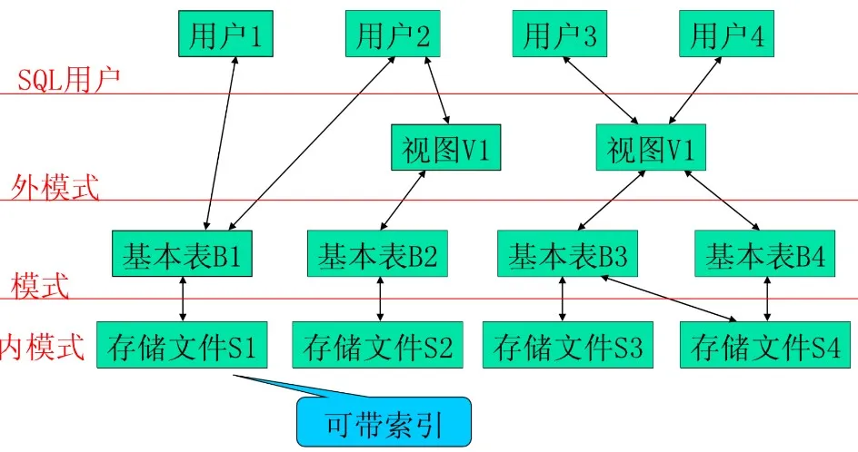

本章重点介绍数据库的基本概念、数据管理技术的发展过程、数据库系统结构和数据库应用系统的组成等内容，并引入概念模型和数据模型。

<!-- more -->

## 1.1 数据库与数据管理基本概念

*   **数据 (Data)**：对客观事物的符号表示，用于描述客观事物的原始事实。数据是数据库中最基本的存储对象。不仅是数字，文字、图形、图像、语音、视频等，都可以通过编码归之于数据的范畴。
*   **数据库 (Database, DB)**：存储在计算机内的、有组织的、可共享的数据集合。具有最小冗余度、较高的数据独立性和可扩展性。
*   **数据库管理系统 (Database Management System, DBMS)**：专门用于管理数据库的系统软件。提供数据的定义、创建、维护、查询和汇总等操作功能，并能够对数据库进行统一控制，以保证数据的安全性、完整性、并发使用及发生故障后的数据恢复。
*   **数据库应用系统 (Database Application System, DBAS)**：利用数据库技术管理数据的应用软件系统。一般由数据库、DBMS（及开发工具）、应用程序、数据库管理员 (DBA) 和用户构成。

## 1.2 数据管理技术的发展阶段

数据管理技术经历了人工管理、文件系统和数据库系统 3 个发展阶段。其主要特征对比如下：

| 特征 | 人工管理阶段 (20 世纪 50 年代中期前) | 文件系统阶段 (50 年代后期至 60 年代中期) | 数据库系统阶段 (60 年代后期起) |
| :--- | :--- | :--- | :--- |
| **数据保存** | 不保存，计算完即从内存释放 | 长期保存于外部存储器中 | 长期保存于外部存储器中 |
| **管理软件** | 无专用管理软件，由应用程序自己管理 | 有专门的文件系统负责数据管理 | 有统一的数据库管理系统 (DBMS) 负责管理 |
| **数据独立性**| 无独立性，数据与程序紧密绑定 | 独立性差，逻辑结构改变需修改程序 | 高独立性 (物理独立性与逻辑独立性) |
| **数据共享性**| 不共享，冗余度极大 | 共享性差，冗余度大，易产生数据不一致 | 高共享，冗余度小，一致性好 |

## 1.3 数据模型与概念模型

*   **概念模型 (Conceptual Model)**：独立于计算机系统的信息结构模型，主要用于数据库设计阶段。最常用的是 **E-R 模型 (实体-联系模型)**。
    *   **实体 (Entity)**：客观存在并可相互区别的事物，如一个学生、一门课程。
    *   **属性 (Attribute)**：实体所具有的某种特性，如学生的学号、姓名。
    *   **联系 (Relationship)**：实体内部及实体之间的联系。实体之间的联系有一对一 ($1:1$)、一对多 ($1:n$) 和多对多 ($m:n$) 三种。
*   **数据模型 (Data Model)**：数据库中数据的组织与存储结构，是 DBMS 的实现基础。主要包括：
    1.  **关系模型 (Relational Model)**：用二维表结构表示实体及其联系。
    2.  **层次模型 (Hierarchical Model)**：用树状结构表示实体及联系，有且仅有一个无双亲的根结点，其他结点有且仅有一个双亲结点。
    3.  **网状模型 (Network Model)**：用网状结构表示实体及联系，允许一个以上结点无双亲，或一个结点有多个双亲。
    4.  **面向对象模型 (Object-Oriented Model)**：将面向对象方法与关系数据库技术相结合的数据模型。

## 1.4 数据库应用系统的三级数据模式结构

数据库应用系统采用了外模式、模式和内模式三级模式结构，这不仅提高了数据的逻辑抽象级别，更保证了系统的数据独立性：

*   **外模式 (External Schema)**：也称子模式或用户模式，是数据库用户（包括应用程序员和最终用户）能够看见和使用的局部数据的逻辑结构和特征的描述。MySQL 中通常通过 **视图 (View)** 来实现外模式。
*   **模式 (Schema)**：也称概念模式，是数据库中全体数据的逻辑结构和特征的公用描述，是所有用户的公共数据视图。在 MySQL 中，模式通过 `CREATE DATABASE` 和 `CREATE TABLE` 等 DDL 命令定义。
*   **内模式 (Internal Schema)**：也称存储模式，是对数据物理结构和存储方式的描述，规定了数据在磁盘上的物理组织形式（如存储结构、索引方式等），由 DBMS 自动管理。

:::tip[二级映像与数据独立性]
DBMS 在三级模式之间提供了两层映像，从而实现了高度的数据独立性：
1.  **外模式／模式映像**：保证了数据的 **逻辑独立性**。当模式改变时（如增加新列），只需修改外模式／模式映像，即可使外模式（以及依赖于外模式的应用程序）保持不变。
2.  **模式／内模式映像**：保证了数据的 **物理独立性**。当数据的物理存储结构改变时（如更换索引结构），只需修改模式／内模式映像，即可使模式（以及上层程序）保持不变。
:::

## 1.5 数据库设计过程

数据库设计主要分为以下六个阶段：
1.  **需求分析**：收集用户需求，形成需求规格说明书。
2.  **概念设计**：将需求抽象为独立于 DBMS 的概念结构，输出 **全局 E-R 图**。
3.  **逻辑设计**：将概念模型 (E-R 图) 转化为特定 DBMS 支持的关系数据模型 (关系模式)，并利用 **范式理论** 进行规范化优化。
4.  **物理设计**：为逻辑数据模型选取合适的存储结构和存取路径 (如索引)。
5.  **实施阶段**：编写 DDL 创建数据库、表，装载数据，编写和调试应用程序。
6.  **运行和维护**：系统投入运行后的日常备份、监控、性能调优及修改升级。\n