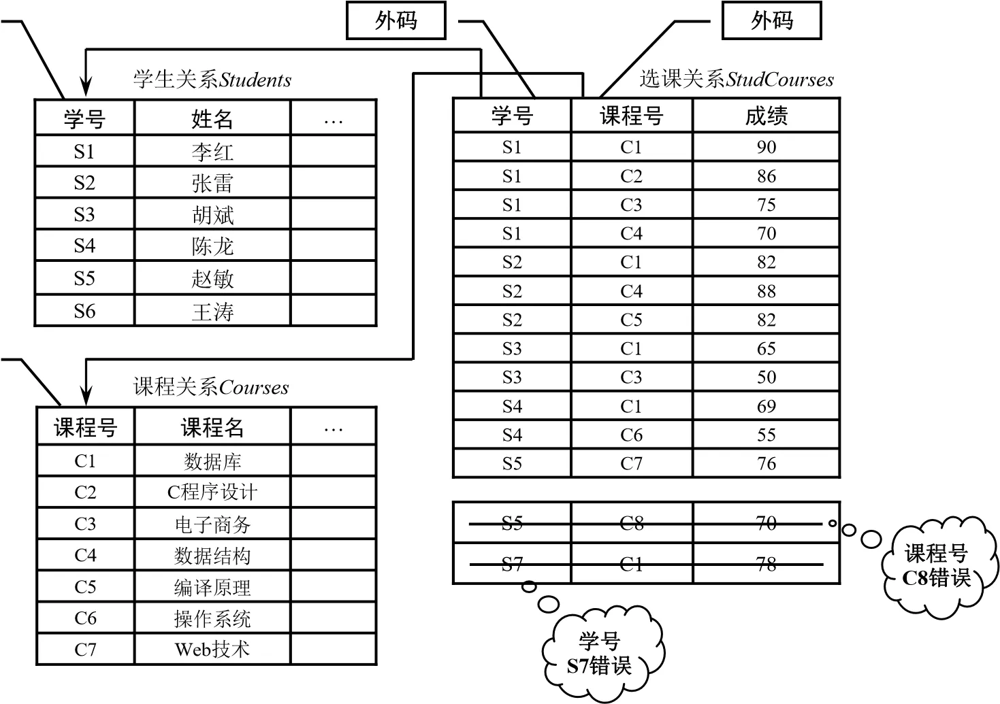
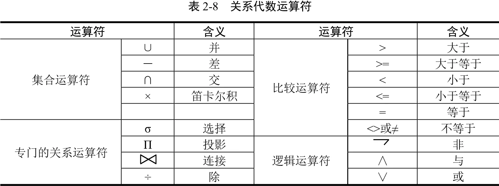
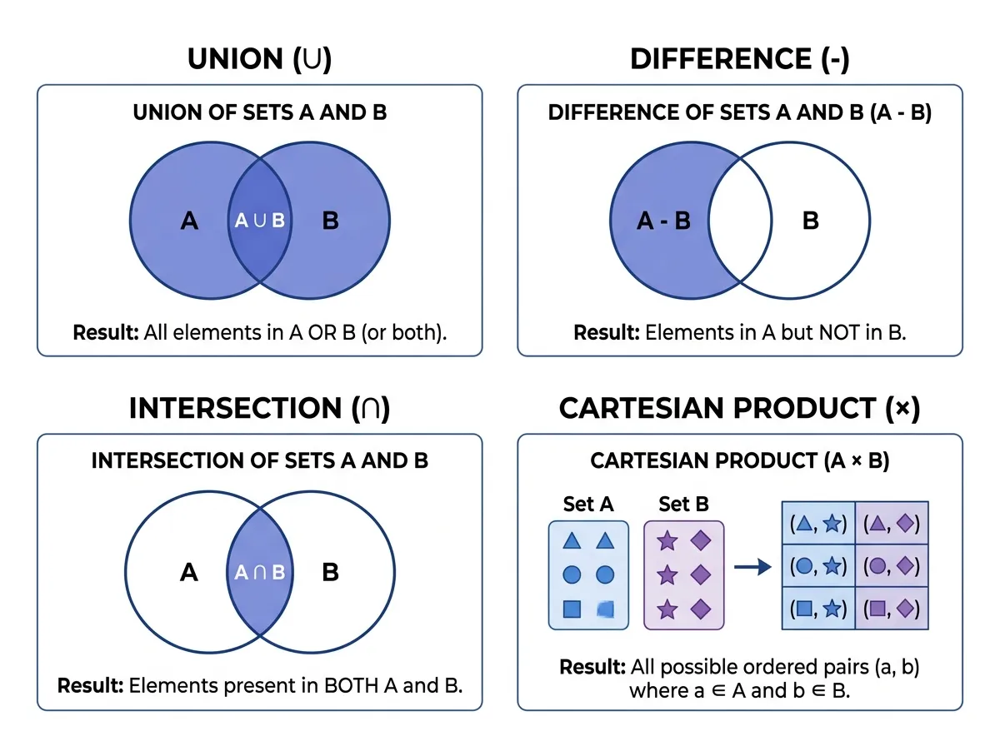

:::warning[阅读提示]
本文配图包含高亮/纯白底色内容，暗光环境下阅读请注意调整屏幕亮度，避免刺眼。
:::

本章重点介绍关系模型的基本概念与组成部分，重点介绍关系代数及其各种运算和查询优化等价变换。

<!-- more -->

## 2.1 关系模型的基本概念

在关系模型中，数据的逻辑结构是一张二维表。
*   **关系（Relation）**：一个关系对应一张二维表。
*   **属性（Attribute）**：表中的一列即为一个属性。
*   **域（Domain）**：属性的取值范围。
*   **元组（Tuple）**：表中的一行即为一个元组。
*   **关系模式（Relational Schema）**：关系的逻辑描述，格式为：$R(U, D, DOM, F)$，通常简记为 $R(A_1, A_2, \dots, A_n)$，其中 $R$ 为关系名，$A_i$ 为属性名。
*   **候选码（Candidate Key）**：能唯一标识关系中一个元组的属性或属性组。
*   **主码（Primary Key）**：从候选码中选定一个用于唯一标识元组的属性（组）。
*   **外码（Foreign Key）**：关系 $R$ 中的某个属性组 $F$ 不是 $R$ 的码，但它是另一个关系 $S$ 的主码，则称 $F$ 为 $R$ 的外码。

## 2.2 关系完整性约束

关系模型中有三类完整性约束：
1.  **实体完整性（Entity Integrity）**：若属性 $A$ 是基本关系 $R$ 的主属性，则 $A$ 不能取空值（NULL）。
2.  **参照完整性（Referential Integrity）**：若关系 $R$ 的外码 $F$ 参照关系 $S$ 的主码 $K$，则 $R$ 中每个元组在 $F$ 上的值必须要么为空值，要么等于 $S$ 中某个元组的主码值。
3.  **用户定义完整性 (User-defined Integrity)**：针对具体应用的数据约束，如限制性别只能为“男”或“女”，年龄在 $0 \sim 120$ 之间（MySQL 中通过 `CHECK` 约束实现）。

## 2.3 关系代数运算

关系代数是一种抽象的查询语言，其运算对象和运算结果都是关系。关系代数运算符主要分为传统集合运算和专门关系运算：

### 2.3.1 传统的集合运算

传统集合运算要求参与运算的关系必须是 **同姓关系**（即属性个数相同，对应属性的域也相同）。
*   **并 (Union, $\cup$)**：$R \cup S = \{ t \mid t \in R \lor t \in S \}$
*   **差 (Difference, $-$)**：$R - S = \{ t \mid t \in R \land t \notin S \}$
*   **交 (Intersection, $\cap$)**：$R \cap S = \{ t \mid t \in R \land t \in S \}$，可以表示为 $R - (R - S)$
*   **广义笛卡尔积 (Cartesian Product, $\times$)**：$R \times S$，结果的属性数为 $R$ 与 $S$ 属性数之和，元组数为两关系元组数之积。

### 2.3.2 专门的关系运算

专门的关系运算涉及关系内部的结构（行和列）。
*   **选择 (Selection, $\sigma_{F}(R)$)**：在关系 $R$ 中选择满足给定条件 $F$ 的元组。对应 SQL 中的 `WHERE` 子句。
*   **投影 (Projection, $\pi_{A}(R)$)**：在关系 $R$ 中选择若干属性列 $A$ 组成新的关系，并去除重复行。对应 SQL 中的 `SELECT DISTINCT` 子句。
*   **连接 (Join, $R \bowtie_{A \theta B} S$)**：从两个关系的笛卡尔积中选取在指定属性上满足 $\theta$ 比较条件的元组。
    *   **等值连接**：比较运算符 $\theta$ 为“$=$”的连接。
    *   **自然连接 ($R \bowtie S$)**：在两个关系的 **同名属性** 上进行等值连接，并在结果中去除重复的同名列。
*   **除 (Division, $R \div S$)**：设关系 $R$ 属性为 $X \cup Y$，关系 $S$ 属性为 $Y$。$R \div S$ 的结果是一个新关系，其属性为 $X$，其中的元组 $x$ 满足其与 $S$ 中所有元组的组合都在 $R$ 中。常用于求解“查询选修了 **全部** 课程的学生学号”等包含“全部/所有”语义的查询。

## 2.4 查询优化与代数等价变换

查询优化是关系数据库系统提高执行效率的关键。代数优化通过对关系代数表达式进行等价变换，减少中间关系的大小。
*   **优化的一般准则**：
    1.  **选择运算下移**：尽早执行选择操作，以极大减少后续连接操作的数据量（最重要准则）。
    2.  **投影与选择同时执行**：在下移选择的同时进行投影，减少元组宽度。
    3.  **合并选择和投影**：避免多次扫描关系。
*   **常用等价变换规则**：
    *   连接与笛卡尔积的交换律与结合律：$R \bowtie S \equiv S \bowtie R$；$(R \bowtie S) \bowtie T \equiv R \bowtie (S \bowtie T)$。
    *   选择的分配律：$\sigma_F(R \cup S) \equiv \sigma_F(R) \cup \sigma_F(S)$；$\sigma_F(R \bowtie S) \equiv \sigma_F(R) \bowtie S$（若条件 $F$ 只涉及关系 $R$ 的属性）。

\n