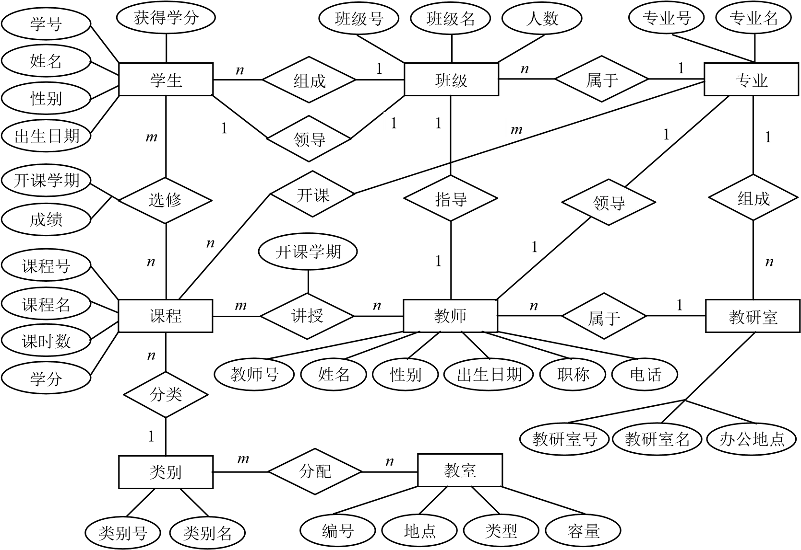
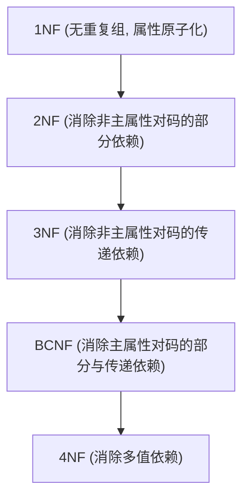

本章详细介绍采用 E-R 图设计数据库的方法和步骤，具体描述关系数据库规范化理论与模式分解方法。

<!-- more -->

## 3.1 概念结构设计中的视图集成与冲突解决

在设计大型数据库时，通常先设计各部门的局部 E-R 图，然后将其合并为全局 E-R 图，这一过程称为 **视图集成**。在集成时需要消除以下三种冲突：
1.  **属性冲突**：
    *   *属性域冲突*：如同一个属性在不同局部 E-R 图中定义的类型或长度不同。
    *   *属性取值单位冲突*：如重量单位在局部表 A 中是“克”，在局部表 B 中是“千克”。
2.  **命名冲突**：
    *   *同名异义*：不同实体使用了相同的名称。
    *   *异名同义*：同一实体在不同视图中使用了不同名称，如“客户”与“订货商”。
3.  **结构冲突**：
    *   同一对象在某个视图中被当作实体，在另一个视图中被当作属性。
    *   同一实体在不同视图中包含的属性个数和排列不同。
    *   实体之间的联系在不同视图中呈现出不同的类型（如一处是 $1:n$，另一处是 $m:n$）。

## 3.2 E-R 图向关系模式的转换规则

逻辑设计的核心是将 E-R 图中的实体与联系转换为关系模式：
*   **一个实体** 转换为一个独立的关系模式，实体的属性即为关系的属性，实体的码即为关系的码。
*   **实体间的联系** 转换规则：
    *   **$1:1$ 联系**：可作为一个独立的关系模式（属性包含两端实体的主码），但更常用的是 **合并到任意一端**（将一端实体的主码作为外码加入另一端，并添加唯一性约束）。
    *   **$1:n$ 联系**：可作为一个独立的关系模式，但更常用的是 **合并到 $n$ 端（多端）**（将 $1$ 端实体的主码作为外码加入 $n$ 端关系中，并加入联系自身的属性）。
    *   **$m:n$ 联系**：**必须转换为一个独立的关系模式**。该关系的属性为两端实体的主码加上联系自身的属性，其主码为两端实体主码的组合。

## 3.3 规范化设计理论 (范式)

规范化理论用于指导关系模式的逻辑设计，以减少数据冗余，避免 **插入异常、删除异常和修改异常**。

### 3.3.1 函数依赖 (Functional Dependency, FD)

设 $R(U)$ 是属性集 $U$ 上的关系模式，$X, Y$ 是 $U$ 的子集。若对于 $R(U)$ 的任意一个可能的关系，不可能存在两个元组在 $X$ 上的属性值相等，而在 $Y$ 上的属性值不等，则称“$X$ 函数决定 $Y$”或“$Y$ 函数依赖于 $X$”，记作 $X \to Y$。
*   **完全函数依赖 (Full FD, $X \xrightarrow{f} Y$)**：$X \to Y$，并且对于 $X$ 的任何真子集 $X'$，都有 $X' \not\to Y$。
*   **部分函数依赖 (Partial FD, $X \xrightarrow{p} Y$)**：$X \to Y$，但 $Y$ 不完全函数依赖于 $X$（即存在 $X$ 的真子集 $X'$ 使得 $X' \to Y$）。
*   **传递函数依赖 (Transitive FD, $X \xrightarrow{t} Y$)**：若 $X \to Y$（且 $Y \not\to X$），$Y \to Z$，且 $Z \notin Y$，则称 $Z$ 传递函数依赖于 $X$。

### 3.3.2 范式级别 (1NF $\sim$ BCNF)

关系模式满足不同级别的规范化要求，称为范式 (Normal Form, NF)。

1.  **第一范式 (1NF)**：关系中的所有属性都是不可分割的基本数据项（原子性）。
    > *存在问题*：冗余度大；插入、删除及更新异常。
2.  **第二范式 (2NF)**：满足 1NF，且 **每一个非主属性都完全函数依赖于任何候选码**（消除部分函数依赖）。若主码为单属性，则自然满足 2NF。
    > *存在问题*：仍存在传递依赖，导致插入、删除异常。
3.  **第三范式 (3NF)**：满足 2NF，且 **不存在任何非主属性传递依赖于任何候选码**。
    > *判定方法*：若 $X \to Y$，则 $X$ 必包含候选码，或 $Y$ 是主属性。
4.  **BC 范式 (BCNF)**：满足 3NF，且 **关系模式中每一个函数依赖 $X \to Y$ 的决定因素 $X$ 都必须包含候选码**（消除了主属性对码的部分和传递函数依赖）。

## 3.4 最小函数依赖集与求候选码

*   **最小函数依赖集 (Minimal Cover)** 满足三个条件：
    1.  右部属性单一化（右边都只有一个属性）。
    2.  无多余的函数依赖（去掉某一个 FD 后，剩下的 FD 集仍等价）。
    3.  函数依赖左部无多余属性（对于左部为多属性的 FD，去掉其中一个属性后仍成立则需简化）。
*   **快速求码算法**：
    对于给定的属性集 $U$ 和函数依赖集 $F$：
    1.  计算所有属性在 $F$ 中出现的方位。将属性分为四类：
        *   **$L$ 类**：只出现在 FD 左部的属性。
        *   **$R$ 类**：只出现在 FD 右部的属性。
        *   **$LR$ 类**：在左右部都出现过的属性。
        *   **$N$ 类**：左右部都未出现过的属性。
    2.  **主属性必包含 $L$ 类和 $N$ 类属性**。设 $X = L \cup N$。
    3.  计算属性闭包 $X^+$。若 $X^+ = U$，则 $X$ 即为唯一的候选码。
    4.  若 $X^+ \neq U$，则依次将 $LR$ 类的单个或组合属性加入 $X$ 中计算闭包，直到闭包包含 $U$ 全集，此时得到的组合即为候选码。\n