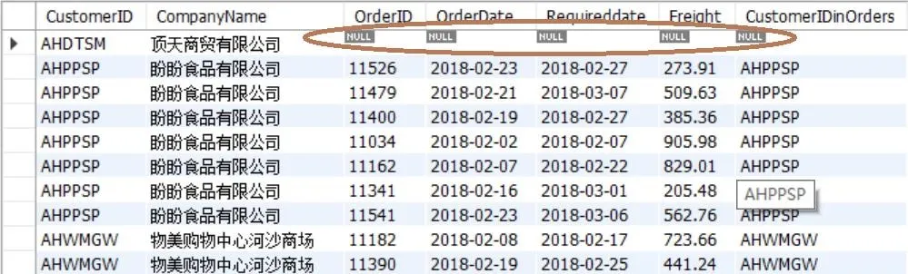

:::warning[阅读提示]
本文配图包含高亮/纯白底色内容，暗光环境下阅读请注意调整屏幕亮度，避免刺眼。
:::


本章详细介绍复杂检索的高级特性，包括连接查询、窗口函数、公用表表达式（CTE）和子查询。

<!-- more -->

## 6.1 高阶连接与逻辑检索

*   **外连接（Outer Join）**：
    *   `LEFT JOIN`：返回左表所有行，右表无匹配的显示 NULL。
    *   `RIGHT JOIN`：返回右表所有行，左表无匹配的显示 NULL。
*   **自连接 (Self-Join)**：表与其自身进行连接，通常用于处理包含上下级关系或同表内数据横向对比的场景。



## 6.2 窗口函数与统计排名

窗口函数允许在不改变行数的前提下对数据子集进行聚合和计算。
语法格式：`函数名() OVER ([PARTITION BY 列] ORDER BY 列)`。
*   `ROW_NUMBER()`：为结果集的每一行分配一个唯一的连续序号，即使排序值相同序号也递增（如 $1, 2, 3, 4$）。
*   `RANK()`：跳跃排序，若排序值相同则赋予相同名次，后续名次会产生跳跃（如 $1, 2, 2, 4$）。
*   `DENSE_RANK()`：连续排序，若排序值相同则赋予相同名次，后续名次仍连续不跳跃（如 $1, 2, 2, 3$）。

## 6.3 公用表表达式（CTE) 与递归查询

公用表表达式 (Common Table Expression, CTE）类似于临时视图，在一个单查询语句的生命周期内有效，大幅增强了复杂 SQL 的可读性。

### 6.3.1 递归 CTE 结构

递归 CTE 可以引用自身，是处理树状层级关系（如组织架构、商品分类）的利器。其包含三个核心要素：
1.  **定位点成员（Anchor Member）**：基准查询，不引用 CTE 自身，形成递归的初始集。
2.  **递归成员（Recursive Member）**：通过 `UNION ALL` 联接，引用 CTE 自身并与原表进行连接以逐步向下或向上搜索。
3.  **终止条件（Implicit Stop）**：当上一轮递归未返回任何数据行时，自动终止递归。

```sql title="employee_hierarchy.sql"
-- 查询员工“黄云飞”的各级主管姓名（自底向上递归）
WITH RECURSIVE tmp AS (
  -- 定位点成员：找到初始员工
  SELECT EmployeeID, Employeename, Title, ReportsTo 
  FROM Employees
  WHERE Employeename = '黄云飞'
  
  UNION ALL
  
  -- 递归成员：将当前结果集的主管 ReportsTo 与 Employees 表的主键 EmployeeID 连接
  SELECT a.EmployeeID, a.Employeename, a.Title, a.ReportsTo 
  FROM Employees a 
  JOIN tmp b ON a.EmployeeID = b.ReportsTo
)
SELECT * FROM tmp;
```

```sql title="employee_path.sql"
-- 递归列出所有员工及其完整的汇报线路径（自顶向下递归）
WITH RECURSIVE tmp (id, name, path) AS (
  SELECT EmployeeID, Employeename, CAST(Employeename AS CHAR(255)) FROM Employees
  WHERE ReportsTo IS NULL OR ReportsTo = ''
  UNION ALL
  SELECT a.EmployeeID, a.EmployeeName, CONCAT(RTRIM(b.path), '-->', a.Employeename)
  FROM Employees AS a 
  JOIN tmp AS b ON b.id = a.ReportsTo
)
SELECT * FROM tmp ORDER BY id;
```
### 6.3.2 使用 CTE 创建表

在 MySQL 中，如果需要将 CTE 查询的结果直接保存到新表中，需要将 `WITH` 部分作为 `AS` 之后的子查询主体：

```sql title="correct_cte_create_table.sql"
CREATE TABLE bbb AS 
WITH tmp AS (
  SELECT a.*, b.companyname 
  FROM orders a 
  JOIN Customers b USING(CustomerID) 
  WHERE YEAR(orderdate) = 2018 AND MONTH(Orderdate) = 12 
  LIMIT 100
) 
SELECT * FROM tmp ORDER BY RAND();
```
