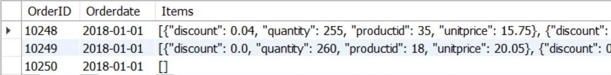

:::warning[阅读提示]
本文配图包含高亮/纯白底色内容，暗光环境下阅读请注意调整屏幕亮度，避免刺眼。
:::


本章介绍数据处理的高级应用，包括原生的 JSON 支持，树状结构表示，以及深度分页查询优化。

<!-- more -->

## 8.1 MySQL 与 JSON 数据处理

MySQL 8.0 提供了原生的 `JSON` 数据类型和丰富的处理函数，将非结构化文档与关系型表格融合。
*   **JSON 常用函数**：
    *   `JSON_OBJECT(key, val, ...)`：将键值对转化为 JSON 对象。
    *   `JSON_ARRAY(val, ...)`：创建 JSON 数组。
    *   `JSON_EXTRACT(json_doc, path)`：提取指定 JSON 路径的值。可以使用缩写操作符 `->`。
    *   `JSON_UNQUOTE(json_val)`：去掉提取出的 JSON 字符串的引号。缩写操作符为 `->>`。

```sql title="json_query.sql"
-- 查询 jsonOrders 表中 items 数组内第一个商品的商品名称
SELECT OrderID, items->'$.items[0].ProductName' AS FirstProduct 
FROM jsonOrders;

-- 提取并去除双引号
SELECT OrderID, items->>'$[0].ProductName' AS FirstProductClean 
FROM jsonOrders;
```



## 8.2 关系数据库中的层次树状模型存储与处理

处理树状结构（如组织架构、商品多级分类）在关系数据库中有几种典型设计：

### 8.2.1 邻接表模型（Adjacency List）每个结点增加一个 `ParentNodeID` 字段指向其父结点。这是最常用也是最符合直觉的存储方式。
*   *优点*：新增、修改节点极为简单，只需修改 `ParentNodeID`。
*   *缺点*：若不借助递归 CTE，很难直接查询某节点的所有祖先或所有子孙（需要多层自连接）。

```sql title="category_tree.sql"
CREATE TABLE CategoryTree (
  CategoryID CHAR(14) PRIMARY KEY,
  CategoryName VARCHAR(100) NOT NULL,
  ParentNodeID CHAR(14),
  IsParentFlag TINYINT, -- 1 表示父节点，0 表示叶子节点
  Level TINYINT,        -- 树的层级
  Ancestor VARCHAR(150) -- 所有祖先节点路径，如 A#A1#
);
```

### 8.2.2 路径枚举模型（Path Enumeration）在表中维护一个 `Ancestor`（或 `Path`）字段，存储该节点到根节点的完整路径（如 `A#A1#`）。
*   *查询所有祖先*：直接读取当前行的 `Ancestor` 字段并使用路径分隔符解析。
*   *查询所有子孙*：使用 `LIKE` 匹配前缀：
    `SELECT * FROM CategoryTree WHERE Ancestor LIKE 'A#A1#%';`

## 8.3 数据库查询性能优化

*   **深度分页优化（LIMIT OFFSET）**：
    *   *问题*：`LIMIT 1000000, 10` 会导致 MySQL 扫描 $1000010$ 行并抛弃前面的 $1000000$ 行，IO 开销巨大。
    *   *优化方案*：**延迟关联（子查询优化）**。先利用覆盖索引（仅检索主键）快速找出分页的主键 ID，然后再与原表关联获取整行数据：
        ```sql title="limit_optimization.sql"
        -- 优化前
        SELECT * FROM Orders ORDER BY OrderDate DESC LIMIT 100000, 10;
        
        -- 优化后
        SELECT a.* FROM Orders a
        JOIN (SELECT OrderID FROM Orders ORDER BY OrderDate DESC LIMIT 100000, 10) b 
        USING(OrderID);
        ```
*   **索引优化建议**：
    *   对 `WHERE` 子句和 `ORDER BY` 子句中频繁出现的列创建索引。
    *   创建联合索引时，必须遵循 **最左匹配原则**（如建立 `(A, B, C)` 索引，只有查询条件包含 `A` 时索引才生效）。
    *   避免在索引列上使用函数或进行表达式计算（如 `WHERE YEAR(OrderDate) = 2018` 会使索引失效，应改为 `WHERE OrderDate BETWEEN '2018-01-01' AND '2018-12-31'`）。\n

:::warning[教材纠错：表名引用不一致]
在原书 JSON 数据检索段落中，建表时声明的表名为 `myJsonOrders`（`CREATE TABLE myJsonOrders...`），但在最后的查询中却直接向 `jsonOrders` 发起了查询（`SELECT ... FROM jsonOrders`），导致查询因表名不存在而报错。

**纠错解析**：应统一把查询段落的表名更正为 `myJsonOrders`：
```sql title="correct_json_query.sql"
SELECT OrderID, items->'$.items[0].ProductName' AS FirstProduct 
FROM myJsonOrders;
```
:::
