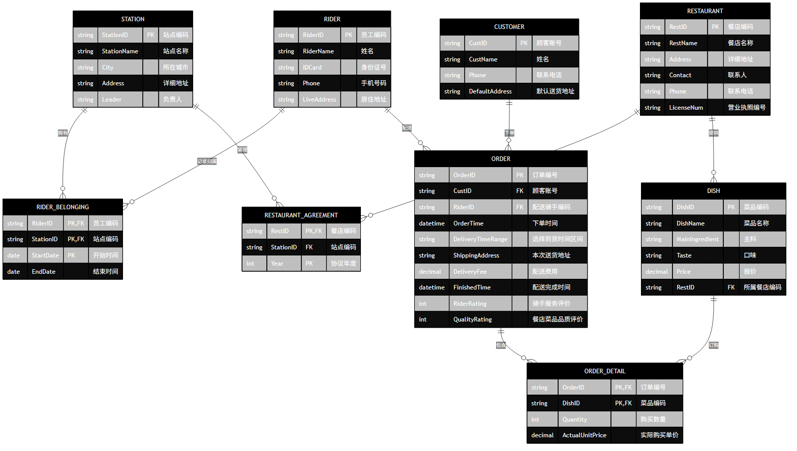

## 解答题

### 1. 数据库的三级模式结构分别是指什么？一个数据库如何创建和使用三级模式结构？

#### (1) 三级模式结构的概念
数据库系统的三级模式结构由 **外模式**、**模式** 和 **内模式** 组成：
- **外模式 (External Schema)**：也称子模式或用户模式。它是数据库用户 (包括应用程序员和最终用户) 能够看见和使用的局部数据的逻辑结构和特征的描述，是数据库用户的数据视图。一个数据库可以有多个外模式。
- **模式 (Schema)**：也称概念模式或逻辑模式。它是数据库中全体数据的逻辑结构和特征的描述，是所有用户的公共数据视图。一个数据库只有一个模式。它是数据库系统模式结构的中心，与物理存储和具体的应用程序都无关。
- **内模式 (Internal Schema)**：也称存储模式。它是数据物理结构和存储方式的描述，是数据在数据库内部的表示方式 (例如存储记录的结构、物理存储介质、索引等)。一个数据库只有一个内模式。

:::note[两级映像与数据独立性]
三级模式结构通过 **外模式/模式映像** 和 **模式/内模式映像** 两级映像，保证了数据库系统具有较高的数据独立性 (包括物理独立性和逻辑独立性)。
:::

#### (2) 如何创建和使用三级模式结构
数据库管理系统 (DBMS) 提供数据定义语言 (DDL) 来创建和定义这三级模式，并通过两级映像来实现它们之间的联系：
1. **定义模式**：使用 DDL 定义数据库的全局逻辑结构。例如在 SQL 中，通过 `CREATE TABLE` 等语句创建基本表，定义字段、数据类型、主键、外键以及各种完整性约束。
2. **定义外模式**：基于全局模式，为不同的用户或应用定义局部视图。在 SQL 中，通常通过创建视图 (`CREATE VIEW`) 或者配置用户级的数据访问权限来实现。
3. **定义内模式**：由 DBMS 负责数据在磁盘上的实际存储与组织。数据库管理员 (DBA) 可以通过配置数据库存储参数 (如表空间、文件路径、聚簇索引、日志文件等) 或使用相应的存储定义语句来优化内模式。
4. **两级映像的使用**：
   - **外模式/模式映像**：当全局模式改变时 (如增加新的属性)，DBA 可以修改外模式/模式映像关系，使外模式保持不变，从而保证了数据的 **逻辑独立性** (应用程序不需要修改)。
   - **模式/内模式映像**：当内模式 (存储结构) 改变时 (如改变存储设备、重建索引)，DBA 可以修改模式/内模式映像关系，使全局模式保持不变，从而保证了数据的 **物理独立性**。

### 2. MySQL 数据库中实现并发控制的主要机制有哪些？在多用户环境下，如果一个用户正在向订单表和订单明细表中插入某个客户的销售订单记录，而另一个用户此时在客户表中删除这个客户，阐述如何使用并发控制机制来防止数据的不一致性。

#### (1) MySQL 中的并发控制机制
MySQL (尤其是 InnoDB 存储引擎) 实现并发控制主要依赖以下三大机制：
- **锁机制 (Locking)**：
  - **按锁粒度划分**：表级锁 (Table Locks) 和行级锁 (Row Locks)。InnoDB 默认使用行级锁，以提供更高的并发性能。
  - **按锁兼容性划分**：共享锁 (Shared Locks，简称 S 锁 / 读锁) 和排他锁 (Exclusive Locks，简称 X 锁 / 写锁)。
  - **意向锁 (Intention Locks)**：表级锁，包括意向共享锁 (IS) 和意向排他锁 (IX)，用于指示事务准备在表中某些行上加锁。
- **多版本并发控制 (MVCC - Multi-Version Concurrency Control)**：
  - 用于在 `READ COMMITTED` 和 `REPEATABLE READ` 隔离级别下实现一致性非锁定读。通过保存数据的历史版本 (利用 undo log 和 Read View)，读操作不会阻塞写操作，写操作也不会阻塞读操作，显著提升并发性能。
- **事务隔离级别 (Transaction Isolation Levels)**：
  - 提供了 4 种隔离级别：`READ UNCOMMITTED` (读未提交)、`READ COMMITTED` (读已提交)、`REPEATABLE READ` (可重复读，MySQL 默认级别) 和 `SERIALIZABLE` (可串行化)。隔离级别越高，并发一致性问题越少，但并发性能越低。

#### (2) 避免并发操作导致数据不一致的方案
在多用户环境下，事务 A 向 `orders` (订单表) 和 `order_details` (订单明细表) 插入客户 C 的订单，而事务 B 尝试在 `customers` (客户表) 中删除客户 C。若不加控制，可能导致“孤儿订单” (即订单关联了不存在的客户)，破坏数据库的参照完整性。

可以通过以下机制解决此问题：

##### 方案一：利用外键约束与级联控制 (推荐，引擎层强制保证)
在设计数据库表结构时，将 `orders` 表的 `customer_id` 设为指向 `customers` 表的主键的外键。
- **限制删除 (RESTRICT / NO ACTION)**：如果 `orders` 表中已存在该客户的订单，当事务 B 尝试删除该客户时，MySQL 会直接拒绝该删除操作并报错。
- **级联删除 (CASCADE)**：当事务 B 删除该客户时，MySQL 会自动将该客户在 `orders` 和 `order_details` 中对应的所有订单记录一并删除。

##### 方案二：显式加锁与事务控制 (应用层控制)
通过在事务中显式加锁，使并发操作串行化执行。
1. **事务 A (插入订单)**：首先在 `customers` 表中对该客户记录加排他锁 (X 锁)：
   ```sql title="Transaction A - 锁定客户记录"
   -- 开启事务
   START TRANSACTION;
   -- 获取该客户行的排他锁，防止被其他事务修改或删除
   SELECT * FROM customers WHERE id = 'C' FOR UPDATE;
   -- 插入订单及订单明细
   INSERT INTO orders (order_id, customer_id, ...) VALUES ('O1001', 'C', ...);
   INSERT INTO order_details (detail_id, order_id, ...) VALUES ('D1001', 'O1001', ...);
   -- 提交事务，释放锁
   COMMIT;
   ```
2. **事务 B (删除客户)**：执行删除时，MySQL 会自动尝试获取该客户行的排他锁 (X 锁)：
   ```sql title="Transaction B - 删除客户"
   START TRANSACTION;
   -- 尝试删除该客户，这需要获取该行的排他锁
   DELETE FROM customers WHERE id = 'C';
   COMMIT;
   ```
- **并发控制效果**：
  - 如果事务 A 先执行，它会持有客户 C 的行级排他锁。事务 B 执行 `DELETE` 时会被阻塞，直到事务 A 提交并释放锁。
  - 事务 A 提交后，事务 B 继续执行。由于此时 `orders` 中已存在该客户的订单，如果设置了外键约束 (RESTRICT)，事务 B 的删除操作将被拒绝，从而防止了数据不一致。

:::tip[提示]
在实际生产开发中，**外键约束**与**显式事务加锁**通常配合使用，以双重保障数据的参照完整性与并发安全性。
:::

### 3. 设关系模式 $R(A, B, C, D, E)$，根据语义有如下函数依赖集：$F = \{D \to C, CE \to B, BC \to D, DE \to A\}$。

#### (1) 计算 $(CE)_{F^+}$ 闭包值
计算闭包的步骤如下：
1. 设初始闭包集合 $X^{(0)} = \{C, E\}$。
2. 扫描函数依赖集 $F$：
   - 检查 $CE \to B$：由于左部 $\{C, E\} \subseteq X^{(0)}$，将右部 $B$ 加入闭包中，得到 $X^{(1)} = \{B, C, E\}$。
   - 检查 $BC \to D$：由于左部 $\{B, C\} \subseteq X^{(1)}$，将右部 $D$ 加入闭包中，得到 $X^{(2)} = \{B, C, D, E\}$。
   - 检查 $DE \to A$：由于左部 $\{D, E\} \subseteq X^{(2)}$，将右部 $A$ 加入闭包中，得到 $X^{(3)} = \{A, B, C, D, E\}$。
3. 此时 $X^{(3)}$ 已经包含了关系模式 $R$ 的全部属性，算法终止。

因此，$(CE)_{F^+}$ 闭包值为：
$$(CE)_{F^+} = \{A, B, C, D, E\}$$

#### (2) 求关系 $R$ 的候选码
我们可以通过属性在函数依赖集 $F$ 的左右部出现情况来分析：
- **仅出现在左部的属性 (L 类)**：$E$ (没有依赖指向 $E$，因此 $E$ 必定包含在任何候选码中)。
- **仅出现在右部的属性 (R 类)**：$A$ (没有依赖从 $A$ 出发，因此 $A$ 绝不可能包含在任何候选码中)。
- **双向属性 (LR 类)**：$B, C, D$ (既在左部出现，又在右部出现)。
- **孤立属性 (N 类)**：无。

由于 $E$ 必须包含在候选码中，我们先计算 $E$ 的闭包：
$$E_{F^+} = \{E\} \neq \{A, B, C, D, E\}$$

因此，我们需要将 LR 类的属性 $B, C, D$ 分别与 $E$ 组合，求其闭包：
- **测试组合 $CE$**：
  由第 (1) 问可知，$(CE)_{F^+} = \{A, B, C, D, E\}$。因为其闭包包含全部属性，且其任何真子集 (只有 $\{C\}$ 和 $\{E\}$) 的闭包都不包含全部属性，所以 **$CE$** 是一个候选码。
- **测试组合 $DE$**：
  1. 设 $X^{(0)} = \{D, E\}$。
  2. 检查 $DE \to A$，加入 $A$，得 $X^{(1)} = \{A, D, E\}$。
  3. 检查 $D \to C$，加入 $C$，得 $X^{(2)} = \{A, C, D, E\}$。
  4. 检查 $CE \to B$，由于 $\{C, E\} \subseteq X^{(2)}$，加入 $B$，得 $X^{(3)} = \{A, B, C, D, E\}$。
  5. 闭包包含全部属性。因此，**$DE$** 也是一个候选码。
- **测试组合 $BE$**：
  1. 设 $X^{(0)} = \{B, E\}$。
  2. 扫描 $F$，无法应用任何函数依赖 (各依赖的左部均不被 $\{B, E\}$ 包含)。
  3. 因此 $(BE)_{F^+} = \{B, E\} \neq \{A, B, C, D, E\}$，所以 $BE$ 不是候选码。

任何包含 $CE$ 或 $DE$ 的更大组合 (如 $BCE$ 和 $BDE$) 均不满足候选码的最小性 (Minimality) 条件。

综上所述，关系模式 $R$ 的候选码为：**$CE$** 和 **$DE$**。

#### (3) 关系模式 $R$ 最高属于第几范式
我们从低到高依次判断关系模式 $R$ 符合的范式级别：

1. **第一范式 (1NF)**：
   关系模式 $R$ 的所有属性都是不可再分的原子数据项，因此满足 **1NF**。

2. **第二范式 (2NF)**：
   - 候选码为 **$CE$** 和 **$DE$**。
   - 主属性 (出现在任意候选码中的属性) 为：$C, D, E$。
   - 非主属性 (不出现在任何候选码中的属性) 为：$A, B$。
   - 2NF 要求消除非主属性对候选码的部分函数依赖。
   - 计算候选码真子集的闭包：
     - $C_{F^+} = \{C\}$
     - $D_{F^+} = \{C, D\}$
     - $E_{F^+} = \{E\}$
   - 可以看出，没有任何非主属性 ($A, B$) 依赖于候选码的真子集。因此，非主属性完全函数依赖于候选码，满足 **2NF**。

3. **第三范式 (3NF)**：
   - 3NF 要求对于 $F$ 中的每个非平凡函数依赖 $X \to Y$，要么 $X$ 是超码，要么 $Y$ 是主属性。
   - 依次检查 $F$ 中的函数依赖：
     - $D \to C$：右部 $C$ 是主属性。满足条件。
     - $CE \to B$：左部 $CE$ 是候选码 (超码)。满足条件。
     - $BC \to D$：右部 $D$ 是主属性。满足条件。
     - $DE \to A$：左部 $DE$ 是候选码 (超码)。满足条件。
   - 所有依赖都满足 3NF 规则，因此关系模式 $R$ 满足 **3NF**。

4. **BC 范式 (BCNF)**：
   - BCNF 要求对于每个非平凡函数依赖 $X \to Y$，$X$ 都必须是超码。
   - 检查依赖 $D \to C$：左部 $D$ 仅是主属性的一个子集，并不是超码。
   - 因此，关系模式 $R$ 不满足 BCNF。

综上所述，关系模式 $R$ 最高属于 **3NF (第三范式)**。

## 关系代数

### 关系模式及基础数据结构说明
为了确保关系代数表达式在自然连接 ($\bowtie$) 时不会因为同名但语义不同的属性 (例如 `Students` 中的 `Major` 与 `Teachers` 中的 `Major` 属性) 导致非预期的错误连接，我们在进行连接操作前，先对相关关系模式进行必要的投影或重命名。

已知数据库包含以下五个关系：
- 学生关系：`Students` (Sno, Sname, Gender, Class, Major)
- 课程关系：`Courses` (Cno, Cname, type, Credit)
- 教师关系：`Teachers` (Tno, Tname, birthdate, gender, Title, Major)
- 选课关系：`StudCourses` (Sno, Cno, Period, Grade)
- 授课关系：`Instructions` (Tno, Cno, Period)

---

### 1. 检索 2022-2023-1 学期 “达尔文”和“牛顿”这两位老师授课的“数据库原理与应用”这门课程中有哪些学生成绩是及格的，列出这些学生的学号、姓名、班级、专业和成绩。

:::note[解析与思路]
本小题需要连接学生、选课、授课、课程和教师关系。为了避免学生专业 (`Students.Major`) 和教师专业 (`Teachers.Major`) 发生非预期的自然连接，我们必须在连接前对教师关系进行投影，仅保留关联键 `Tno`。
:::

#### (1) 分步关系代数表达式
- **筛选教师**：筛选出姓名为“达尔文”或“牛顿”的教师编号：
  $$T = \Pi_{Tno} ( \sigma_{Tname = \text{'达尔文'} \lor Tname = \text{'牛顿'}} (Teachers) )$$
- **筛选课程**：筛选出“数据库原理与应用”这门课程的课程编号：
  $$C = \Pi_{Cno} ( \sigma_{Cname = \text{'数据库原理与应用'}} (Courses) )$$
- **筛选当前学期授课记录**：
  $$I = \sigma_{Period = '2022-2023-1'} (Instructions)$$
- **筛选当前学期且成绩及格的选课记录**：
  $$SC = \sigma_{Period = '2022-2023-1' \land Grade \ge 60} (StudCourses)$$
- **筛选学生基本信息**：
  $$S = \Pi_{Sno, Sname, Class, Major} (Students)$$

#### (2) 最终合并表达式
将上述中间结果进行自然连接，并投影目标字段：
$$\text{Result}_1 = \Pi_{Sno, Sname, Class, Major, Grade} ( T \bowtie C \bowtie I \bowtie SC \bowtie S )$$

---

### 2. 检索哪些学生 2022-2023-1 学期所有的“必修”类课程考试成绩都是及格的，而且没有一门课程是因为之前不及格而重修的。

:::note[解析与思路]
本题包含两个核心条件：
1. **所有“必修”课程都及格**：这需要用“选修了必修课的学生集合”减去“有必修课不及格的学生集合”。
2. **没有重修不及格课程**：重修定义为在 `2022-2023-1` 学期选了某门课，且在之前的学期中该课程的成绩小于 $60$ 分。这需要找出存在这种重修行为的学生，并从总学生集合中将其减去。
:::

#### (1) 分步关系代数表达式
- **获取所有“必修”课程的编号**：
  $$C_{\text{comp}} = \Pi_{Cno} ( \sigma_{type = \text{'必修'}} (Courses) )$$
- **获取当前学期选读了“必修”课的学生集合**：
  $$S_{\text{took}} = \Pi_{Sno} ( \sigma_{Period = '2022-2023-1'} (StudCourses) \bowtie C_{\text{comp}} )$$
- **获取当前学期有“必修”课不及格的学生集合**：
  $$S_{\text{failed}} = \Pi_{Sno} ( \sigma_{Period = '2022-2023-1' \land Grade < 60} (StudCourses) \bowtie C_{\text{comp}} )$$
- **当前学期所有“必修”课均及格的学生集合**：
  $$S_{\text{all\_pass}} = S_{\text{took}} - S_{\text{failed}}$$
- **找出当前学期存在“因之前不及格而重修”的学生集合**：
  - 首先，找出学生在当前学期所选的所有课程：
    $$SC_{\text{curr}} = \Pi_{Sno, Cno} ( \sigma_{Period = '2022-2023-1'} (StudCourses) )$$
  - 其次，找出学生在历史学期不及格的课程：
    $$SC_{\text{past\_failed}} = \Pi_{Sno, Cno} ( \sigma_{Period < '2022-2023-1' \land Grade < 60} (StudCourses) )$$
  - 取交集得到当前学期属于重修且历史不及格的“学生-课程”对：
    $$Retakes = SC_{\text{curr}} \cap SC_{\text{past\_failed}}$$
  - 提取这些学生的学号：
    $$S_{\text{retake}} = \Pi_{Sno} ( Retakes )$$

#### (2) 最终合并表达式
排除有重修历史不及格课程的学生，并与 `Students` 关联获取学号和姓名：
$$\text{Result}_2 = \Pi_{Sno, Sname} ( (S_{\text{all\_pass}} - S_{\text{retake}}) \bowtie Students )$$

---

### 3. 检索学号为 s1 的学生所在的班级中，哪些学生至少选读了 s1 这个学生的全部课程，而且比 s1 这个学生还多选了“人工智能基础”这门课程，列出这些学生的学号和姓名。

:::note[解析与思路]
本题包含三个核心条件：
1. **班级限制**：必须与学号为 `s1` 的学生属于同一个班级 (并排除 `s1` 本人)。
2. **课程包含关系**：学生选修的课程必须包含 `s1` 选修的所有课程 (使用**除法** $\div$ 实现)。
3. **多选特定课程**：在此基础上，还必须多选了“人工智能基础”这门课程。
:::

#### (1) 分步关系代数表达式
- **确定学号为 s1 学生的班级**：
  $$Class_{s1} = \Pi_{Class} ( \sigma_{Sno = 's1'} (Students) )$$
- **找出该班级中除 s1 以外的其他学生**：
  $$S_{\text{class}} = \Pi_{Sno, Sname} ( Students \bowtie Class_{s1} ) - \Pi_{Sno, Sname} ( \sigma_{Sno = 's1'} (Students) )$$
- **找出 s1 学生选修的所有课程编号**：
  $$C_{s1} = \Pi_{Cno} ( \sigma_{Sno = 's1'} (StudCourses) )$$
- **找出“人工智能基础”的课程编号**：
  $$C_{AI} = \Pi_{Cno} ( \sigma_{Cname = \text{'人工智能基础'}} (Courses) )$$
- **构造目标课程集合 (s1 的全部课程加上人工智能基础)**：
  $$C_{\text{req}} = C_{s1} \cup C_{AI}$$
- **使用除法检索至少选修了 $C_{\text{req}}$ 中所有课程的学生学号**：
  $$S_{\text{eligible}} = \Pi_{Sno, Cno} ( StudCourses ) \div C_{\text{req}}$$

#### (2) 最终合并表达式
将班级候选学生与符合课程条件的学生进行自然连接，得到最终的学生学号与姓名：
$$\text{Result}_3 = S_{\text{class}} \bowtie S_{\text{eligible}}$$

## 数据库设计题

### 已知“美团外卖”网上订餐平台数据库至少包含顾客、骑手、站点、餐店、菜品等实体，部分实体的主要属性及语义如下：
1. 该网上订餐平台包含多个美团服务站点，每个美团站点包含站点编码、名称、所在城市、地址、负责人等属性；每个站点可以有多个骑手（快递员），每个骑手包含员工编码、姓名、身份证号、手机号码、居住地址等属性。一个骑手在同一时间内只能属于一个美团站点，但在不同时间中可以加入不同美团站点。
2. 一个美团站点可以有多个加盟餐店，一个餐店同一年度只能与一个美团站点签订加盟协议；餐店包含餐店编码、名称、地址、联系人、联系电话、营业执照编号等属性。
3. 一个餐店可以提供多个菜品，一个菜品只能由一个餐店提供，不同餐店可以有名称相同的菜名；每个菜品包含菜品编码、名称、主料、口味、报价等属性。
4. 顾客包含顾客账号、姓名、联系电话等属性，顾客有一个默认的送货地址，但在不同时间下单可以有不同送货地址；顾客下单时，需要记录下单时间和选择到货的时间（一般是一个区间值），系统产生一个独一无二的订单编号，顾客在不同时间订购同一个菜品时，其购买单价可能不同。
5. 平台按下单的订单编号分配骑手进行配送，每个骑手每天可接单不超过 100 件；每次配送需要记录其配送费用和配送完成时间，并对骑手服务和餐店菜品品质进行评价。

试根据上述语义完成下列各题。

#### (1) 设计满足上述语义要求的 E-R 图，需标明实体的属性、实体之间的联系以及联系产生的新属性。

我们使用 Mermaid 构建全局 E-R 图，清晰展示实体及其属性、联系类型以及联系属性：



:::note[设计思路解析]
1. **骑手与站点（多对多变体历史联系）**：因为“一个骑手在同一时间内只能属于一个美团站点，但在不同时间中可以加入不同美团站点”，所以骑手与站点并不是单纯的 1:N 关系，而是随时间变化的多对多历史记录。因此我们引入了联系实体 `RIDER_BELONGING`（骑手归属历史），其联合主键包含 `(RiderID, StartDate)`，用以记录骑手在不同时段所属的站点。
2. **餐店与站点（年度约束联系）**：由于“一个餐店同一年度只能与一个美团站点签订加盟协议”，我们在 `RESTAURANT_AGREEMENT`（加盟协议）中引入了年度属性 `Year`。在该联系中，联合主键为 `(RestID, Year)`，从而在模型层面强约束了同一个餐店在同一年只能加盟一个站点。
3. **订单明细与价格变动**：由于“顾客在不同时间订购同一个菜品时，其购买单价可能不同”，因此在订单和菜品的多对多关联实体 `ORDER_DETAIL` 中，必须包含属性 `ActualUnitPrice`（实际购买单价）和 `Quantity`（数量），用以记录下单时的实时交易快照。
:::

#### (2) 将该 E-R 图转换成关系模式，并指出每一个关系模式中的主码和外码。

根据以上 E-R 图的设计，将其转换为关系模式（下划线表示**主码**，加粗或注释表示**外码**）：

1. **美团站点模式**：
   `Station` (<u>StationID</u>, StationName, City, Address, Leader)
   - **主码**：`StationID`
   - **外码**：无

2. **骑手模式**：
   `Rider` (<u>RiderID</u>, RiderName, IDCard, Phone, LiveAddress)
   - **主码**：`RiderID`
   - **外码**：无

3. **骑手站点归属历史模式**：
   `RiderBelonging` (<u>RiderID</u>, <u>StationID</u>, <u>StartDate</u>, EndDate)
   - **主码**：`(RiderID, StationID, StartDate)`
   - **外码**：`RiderID` 外键引用 `Rider`；`StationID` 外键引用 `Station`

4. **加盟餐店模式**：
   `Restaurant` (<u>RestID</u>, RestName, Address, Contact, Phone, LicenseNum)
   - **主码**：`RestID`
   - **外码**：无

5. **加盟协议模式**：
   `RestaurantAgreement` (<u>RestID</u>, <u>Year</u>, StationID)
   - **主码**：`(RestID, Year)`
   - **外码**：`RestID` 外键引用 `Restaurant`；`StationID` 外键引用 `Station`

6. **菜品模式**：
   `Dish` (<u>DishID</u>, DishName, MainIngredient, Taste, Price, RestID)
   - **主码**：`DishID`
   - **外码**：`RestID` 外键引用 `Restaurant`

7. **顾客模式**：
   `Customer` (<u>CustID</u>, CustName, Phone, DefaultAddress)
   - **主码**：`CustID`
   - **外码**：无

8. **订单模式**：
   `Order` (<u>OrderID</u>, CustID, RiderID, OrderTime, DeliveryTimeRange, ShippingAddress, DeliveryFee, FinishedTime, RiderRating, QualityRating)
   - **主码**：`OrderID`
   - **外码**：`CustID` 外键引用 `Customer`；`RiderID` 外键引用 `Rider`

9. **订单明细模式**：
   `OrderDetail` (<u>OrderID</u>, <u>DishID</u>, Quantity, ActualUnitPrice)
   - **主码**：`(OrderID, DishID)`
   - **外码**：`OrderID` 外键引用 `Order`；`DishID` 外键引用 `Dish`

---

#### (3) 使用 MySQL 建表语句创建“骑手”这个关系模式的数据表，设置其主键和外键等约束条件；同时添加 2 个计算列，要求根据“骑手”的身份证号，自动计算得到“骑手”的出生日期（date 型，例如 1986-02-10）和 “性别”（采用“男”或“女”两种值）这两个列的值。

:::tip[设计抉择说明]
根据语义 “一个骑手在同一时间内只能属于一个美团站点，但在不同时间中可以加入不同美团站点”：
- **方案 A（历史归属解耦设计）**：若采用历史记录表 `RiderBelonging` 单独存储归属关系，则骑手基础表 `Riders` 本身不需要设置外键。
- **方案 B（当前归属简化设计）**：在实际教学或考试中，常简化为在骑手表上保存其**当前所属站点**的 `StationID` 作为外键。

为了保证答案的严谨与全面，我们下面给出**方案 B（包含所属站点外键）**的建表 DDL。如采用方案 A，只需将建表语句中的外键 `StationID` 字段及约束去掉即可。
:::

```sql title="create_table_riders.sql"
CREATE TABLE IF NOT EXISTS `riders` (
    `RiderID`     VARCHAR(20)  NOT NULL COMMENT '员工编码',
    `RiderName`   VARCHAR(50)  NOT NULL COMMENT '姓名',
    `IDCard`      CHAR(18)     NOT NULL COMMENT '身份证号',
    `Phone`       VARCHAR(20)  NOT NULL COMMENT '手机号码',
    `LiveAddress` VARCHAR(255) DEFAULT NULL COMMENT '居住地址',
    `StationID`   VARCHAR(20)  DEFAULT NULL COMMENT '当前所属美团站点编码（简化外键关联）',
    
    -- 计算列 1：根据身份证第 7-14 位，转换为出生日期 (date 型)
    `BirthDate`   DATE GENERATED ALWAYS AS (
        STR_TO_DATE(SUBSTRING(`IDCard`, 7, 8), '%Y%m%d')
    ) STORED COMMENT '出生日期（由身份证号自动生成）',
    
    -- 计算列 2：根据身份证第 17 位奇偶，转换为性别
    `Gender`      CHAR(1) GENERATED ALWAYS AS (
        IF(CAST(SUBSTRING(`IDCard`, 17, 1) AS UNSIGNED) % 2 = 1, '男', '女')
    ) STORED COMMENT '性别（由身份证号自动生成）',

    -- 约束条件设置
    PRIMARY KEY (`RiderID`),
    UNIQUE KEY `uk_idcard` (`IDCard`),
    CONSTRAINT `fk_rider_station` FOREIGN KEY (`StationID`) REFERENCES `stations` (`StationID`)
        ON DELETE SET NULL 
        ON UPDATE CASCADE
) ENGINE=InnoDB DEFAULT CHARSET=utf8mb4;
```

:::tip[MySQL 计算列语法与实现细节]
1. **`GENERATED ALWAYS AS ... STORED`**：表示使用存储型计算列（STORED），即每次插入或修改数据时计算并物理写入磁盘，从而可以对其创建索引，提高查询性能。
2. **`SUBSTRING(IDCard, 7, 8)`**：身份证第 7 位起连续 8 位为出生年月日（格式如 `19860210`），通过 `STR_TO_DATE` 函数转换为 MySQL 标准 `DATE` 类型。
3. **`SUBSTRING(IDCard, 17, 1)`**：身份证第 17 位为性别标识符，奇数为男，偶数为女。通过对 2 取模 `MOD(..., 2)` 或 `% 2` 结合 `IF` 函数实现性别的自动映射。
:::


## 程序设计题

### 1. 将下列关系代数转换为一条 SQL 语句

#### (1) 原关系代数表达式
$$
\begin{aligned}
R = \Pi_{OrderID} \Big( & \sigma_{Orderdate \ge '2018-01-01' \land Orderdate \le '2018-06-30'}(Orders) \bowtie OrderItems \bowtie \sigma_{Productname = \text{'青岛啤酒'}}(Products) \\
& \cap \sigma_{Orderdate \ge '2018-01-01' \land Orderdate \le '2018-06-30'}(Orders) \bowtie OrderItems \bowtie \sigma_{Productname = \text{'百威啤酒'}}(Products) \Big)
\end{aligned}
$$
$$\Pi_{CustomerID, Companyname}(Customers) - \Pi_{CustomerID, Companyname}( R \bowtie Customers )$$

#### (2) 标准化与大写改写后的关系代数表达式
我们将原表达式进行标准化（添加合理的关联表连接，并按照要求将所有投影操作符整理为大写的 $\Pi$）：

- **第一步 (求同时购买了“青岛啤酒”和“百威啤酒”的订单集 $R$)**：
  $$
  \begin{aligned}
  R = & \Pi_{OrderID} \left( \sigma_{Orderdate \ge '2018-01-01' \land Orderdate \le '2018-06-30'}(Orders) \bowtie OrderItems \bowtie \sigma_{Productname = \text{'青岛啤酒'}}(Products) \right) \\
  & \cap \Pi_{OrderID} \left( \sigma_{Orderdate \ge '2018-01-01' \land Orderdate \le '2018-06-30'}(Orders) \bowtie OrderItems \bowtie \sigma_{Productname = \text{'百威啤酒'}}(Products) \right)
  \end{aligned}
  $$
- **第二步 (与客户及订单表连接，求差集获得未购买的客户)**：
  $$\Pi_{CustomerID, Companyname}(Customers) - \Pi_{CustomerID, Companyname}( R \bowtie Orders \bowtie Customers )$$

:::note[业务语义]
该查询的实际业务语义为：**检索在 2018-01-01 至 2018-06-30 期间，没有在同一个订单中同时购买过“青岛啤酒”和“百威啤酒”的客户的客户编码 (CustomerID) 和公司名称 (Companyname)。**
:::

#### (3) 对应的 SQL 语句实现
根据标准化的语义，我们可以使用以下几种标准的 SQL 写法来实现：

##### 写法一：使用 EXCEPT 集合差操作 (最贴合关系代数减号)
```sql title="solution_except.sql"
SELECT CustomerID, Companyname
FROM customers
EXCEPT
SELECT c.CustomerID, c.Companyname
FROM customers c
JOIN orders o ON c.CustomerID = o.CustomerID
WHERE o.OrderID IN (
    -- 购买了“青岛啤酒”的订单 ID 集
    SELECT o1.OrderID
    FROM orders o1
    JOIN orderitems oi1 ON o1.OrderID = oi1.OrderID
    JOIN products p1 ON oi1.ProductID = p1.ProductID
    WHERE o1.OrderDate BETWEEN '2018-01-01' AND '2018-06-30'
      AND p1.Productname = '青岛啤酒'
    INTERSECT
    -- 购买了“百威啤酒”的订单 ID 集
    SELECT o2.OrderID
    FROM orders o2
    JOIN orderitems oi2 ON o2.OrderID = oi2.OrderID
    JOIN products p2 ON oi2.ProductID = p2.ProductID
    WHERE o2.OrderDate BETWEEN '2018-01-01' AND '2018-06-30'
      AND p2.Productname = '百威啤酒'
);
```

##### 写法二：使用 NOT IN 子查询
```sql title="solution_not_in.sql"
SELECT CustomerID, Companyname
FROM customers
WHERE CustomerID NOT IN (
    SELECT o.CustomerID
    FROM orders o
    WHERE o.OrderID IN (
        SELECT o1.OrderID
        FROM orders o1
        JOIN orderitems oi1 ON o1.OrderID = oi1.OrderID
        JOIN products p1 ON oi1.ProductID = p1.ProductID
        WHERE o1.OrderDate BETWEEN '2018-01-01' AND '2018-06-30'
          AND p1.Productname = '青岛啤酒'
        INTERSECT
        SELECT o2.OrderID
        FROM orders o2
        JOIN orderitems oi2 ON o2.OrderID = oi2.OrderID
        JOIN products p2 ON oi2.ProductID = p2.ProductID
        WHERE o2.OrderDate BETWEEN '2018-01-01' AND '2018-06-30'
          AND p2.Productname = '百威啤酒'
    )
);
```

##### 写法三：使用 NOT EXISTS 子查询 (执行效率高)
```sql title="solution_not_exists.sql"
SELECT CustomerID, Companyname
FROM customers c
WHERE NOT EXISTS (
    SELECT 1
    FROM orders o1
    JOIN orderitems oi1 ON o1.OrderID = oi1.OrderID
    JOIN products p1 ON oi1.ProductID = p1.ProductID
    WHERE o1.CustomerID = c.CustomerID
      AND o1.OrderDate BETWEEN '2018-01-01' AND '2018-06-30'
      AND p1.Productname = '青岛啤酒'
      AND EXISTS (
          SELECT 1
          FROM orderitems oi2
          JOIN products p2 ON oi2.ProductID = p2.ProductID
          WHERE oi2.OrderID = o1.OrderID
            AND p2.Productname = '百威啤酒'
      )
);
```

### 2. 存储过程与树型结构数据查询

试创建一个存储过程，输入一个月份（含年份，如 `2019-02`），要求利用视图 `v1` 并按树型结构输出数据检索结果，具体要求如下：
- 树的第一层结点为客户所属的省份（结点文本内容为省份名称与销售额的拼接）；
- 第二层结点为每个省份所属的各个客户信息（结点文本内容为客户编码、客户名称与其销售额的拼接）；
- 第三层为每个客户这个月份的所有销售订单信息（结点文本为订单号、订单日期与订单销售汇总值，按订单日期排序）。
- 整个树型结构中没有销售记录的省份和客户不需要出现。

已知视图 `v1` 定义如下：
```sql title="view_v1.sql"
CREATE OR REPLACE VIEW v1 AS
SELECT a.*,
       b.Amount,
       c.OrderID,
       c.OrderDate,
       c.CustomerID,
       d.Companyname,
       d.RegionID,
       d.CityID
FROM Products   a
JOIN Orderitems b USING (ProductID)
JOIN Orders     c USING (OrderID)
JOIN Customers  d USING (CustomerID);
```

#### (1) 树形结构查询的存储过程实现
我们使用 `UNION ALL` 结合公用表表达式（CTE）分别计算三个层级的销售汇总数据，并按照层次路径 `CONCAT(TRIM(Ancestor), ID)` 进行深度优先排序：
```sql title="sp_tree_query.sql"
DROP PROCEDURE IF EXISTS p1;
DELIMITER $$
CREATE PROCEDURE p1(
    IN $xdate VARCHAR(7)
)
BEGIN
    -- 1. 预计算每个省份 (Region) 在该月份的销售额汇总
    WITH tmp1 AS (
        SELECT RegionID, SUM(Amount) AS Amount1
        FROM v1
        WHERE DATE_FORMAT(OrderDate, '%Y-%m') = $xdate
        GROUP BY RegionID
        HAVING SUM(Amount) > 0
    ),
    -- 2. 预计算每个客户 (Customer) 在该月份的销售额汇总
    tmp2 AS (
        SELECT CustomerID, SUM(Amount) AS Amount2
        FROM v1
        WHERE DATE_FORMAT(OrderDate, '%Y-%m') = $xdate
        GROUP BY CustomerID
        HAVING SUM(Amount) > 0
    ),
    -- 3. 预计算每个订单 (Order) 的销售额汇总
    tmp3 AS (
        SELECT OrderID, SUM(Amount) AS Amount3
        FROM v1
        WHERE DATE_FORMAT(OrderDate, '%Y-%m') = $xdate
        GROUP BY OrderID
        HAVING SUM(Amount) > 0
    )

    -- 第一层：省份结点
    SELECT DISTINCT a.RegionID                                                    AS `ID`,
                    CONCAT(b.AreaName, '(', ROUND(c.Amount1 / 10000, 2), '万元)') AS `Text`,
                    ''                                                            AS `Parentnodeid`,
                    1                                                             AS `Level`,
                    1                                                             AS `Isparentflag`,
                    ''                                                            AS `Ancestor`
    FROM v1    AS a
    JOIN Areas AS b ON a.RegionID = b.AreaID
    JOIN tmp1  AS c ON c.RegionID = b.AreaID

    UNION ALL
    -- 第二层：客户结点
    SELECT DISTINCT a.CustomerID                                                     AS `ID`,
                    CONCAT(a.Companyname, '(', ROUND(c.Amount2 / 10000, 2), '万元)') AS `Text`,
                    a.RegionID                                                       AS `Parentnodeid`,
                    2                                                                AS `Level`,
                    1                                                                AS `Isparentflag`,
                    CONCAT(a.RegionID, '#')                                          AS `Ancestor`
    FROM v1    AS a
    JOIN Areas AS b ON a.CityID = b.AreaID
    JOIN tmp2  AS c ON c.CustomerID = a.CustomerID
    WHERE DATE_FORMAT(a.OrderDate, '%Y-%m') = $xdate

    UNION ALL
    -- 第三层：订单结点
    SELECT DISTINCT a.OrderID                                                AS `ID`,
                    CONCAT(a.OrderID, ' ', a.OrderDate, '(', c.Amount3, ')') AS `Text`,
                    a.CustomerID                                             AS `Parentnodeid`,
                    3                                                        AS `Level`,
                    0                                                        AS `Isparentflag`,
                    CONCAT(a.RegionID, '#', a.CustomerID, '#')               AS `Ancestor`
    FROM v1   AS a
    JOIN tmp3 AS c ON c.OrderID = a.OrderID
    WHERE DATE_FORMAT(a.OrderDate, '%Y-%m') = $xdate

    -- 按照路径进行深度优先排序，使子结点紧跟在父结点下方
    ORDER BY CONCAT(TRIM(Ancestor), ID);

END $$
DELIMITER ;
```

### 3. 存储过程与字符串拆分定位

创建一个存储过程，输入一个字符串 `$data`，其中包含由分号分隔的多个客户编码（例如 `SHCLMY;HNWLGS;HNYJLS;JSBYSP;HNCQYL` 中包含 5 个客户编码）。
试提取 `$data` 中的每个客户编码，从客户表中删除这些客户编码所对应的客户记录，并输出最后一个被删客户之后它的下一个客户（没有下一个客户时，记录其上一个客户）的全部信息，要求输出结果中包含这个客户在客户表中的行序号。已知客户表以客户编码为序排列。

#### (1) 准备工作：创建临时表
为了避免直接修改原始客户表，先将数据复制到临时表 `Customers_tmp` 中进行操作：
```sql title="create_temporary_table.sql"
DROP TABLE IF EXISTS Customers_tmp;
CREATE TEMPORARY TABLE Customers_tmp AS
SELECT *
FROM customers;
```

#### (2) 存储过程的实现
我们定义存储过程 `p3`，利用 `LOCATE` 与 `SUBSTRING` 函数循环截取分号分隔的编码，并在提取后从临时表中删除。最后通过包含行号的视图 `v1` 定位目标客户：
```sql title="sp_delete_and_locate.sql"
DROP PROCEDURE IF EXISTS p3;
DELIMITER $$
CREATE PROCEDURE p3(
    IN $data VARCHAR(1000)
)
BEGIN
    DECLARE $cid CHAR(6);
    DECLARE $maxRowno INT;
    DECLARE $lastRowno INT;
    DECLARE $cid_next CHAR(6);
    DECLARE $cid_prev CHAR(6);

    -- 创建包含行号的视图（默认按主键/客户编码顺序）
    CREATE OR REPLACE VIEW v1 AS
    SELECT ROW_NUMBER() OVER () AS Rowno, a.* 
    FROM Customers AS a;

    -- 追加分号作为截取结束符
    SET $data = CONCAT($data, ';');

    -- 循环拆分字符串并逐个删除临时表中的客户
    WHILE (LOCATE(';', $data) > 0) DO
        SET $cid = SUBSTRING($data, 1, LOCATE(';', $data) - 1);
        SET $data = SUBSTRING($data, LOCATE(';', $data) + 1);

        DELETE FROM Customers_tmp WHERE CustomerID = $cid;
    END WHILE;

    -- 获取最后一个被删客户在视图中的行序号
    SELECT MAX(Rowno) INTO $maxRowno FROM v1;
    SELECT MAX(Rowno) INTO $lastRowno FROM v1 WHERE CustomerID = $cid;
    
    -- 尝试获取下一个客户的编码
    SELECT CustomerID INTO $cid_next FROM v1 WHERE Rowno = $lastRowno + 1;

    -- 输出目标客户（若没有下一个客户则输出上一个客户）
    IF $cid_next IS NULL THEN
        SELECT CustomerID INTO $cid_prev FROM v1 WHERE Rowno = $lastRowno - 1;
        -- 从视图 v1 查询以包含 Rowno 行序号
        SELECT * FROM v1 WHERE CustomerID = $cid_prev;
    ELSE
        SELECT * FROM v1 WHERE CustomerID = $cid_next;
    END IF;
END $$
DELIMITER ;
```

:::tip[提示]
在输出最终客户信息时，为了满足题干中“输出结果中包含这个客户在客户表中的行序号”的要求，我们将查询表从临时表 `Customers_tmp` 调整为了包含 `Rowno` 列的视图 `v1`。
:::

### 4. 触发器与订单编号自动生成

将订单表 `orders` 结构复制到 `myOrders` 新表中，但 `OrderID` 不是数值型数据而是一个字符型数据，长度为 12 位。创建一个触发器，当在订单表中插入一条订单记录时，自动产生订单编号。订单编号的生成规则如下：
- **规则 1**：订单的前 6 位为年份与月份，例如 `201805`；
- **规则 2**：订单编号的后 4 位为序号，序号小于 1000 时左边用 0 补充，例如 `0001`、`0010`、`0999` 等；
- **规则 3**：后四位的序号按月份排序，每个月份从 `0001` 开始计数。例如 `2024040001`、`2024040089`，`2024050001`...

#### (1) 准备工作：复制表结构并修改字段类型
```sql title="create_table_myorders.sql"
DROP TABLE IF EXISTS myOrders;
CREATE TABLE myOrders LIKE orders;
ALTER TABLE myOrders MODIFY OrderID CHAR(12);
```

#### (2) 触发器逻辑实现
我们创建一个 `BEFORE INSERT` 触发器，在每次插入新记录前自动计算并填充 `OrderID`：
```sql title="create_trigger_orderid.sql"
DROP TRIGGER IF EXISTS tr2;
DELIMITER $$
CREATE TRIGGER tr2
    BEFORE INSERT
    ON myOrders
    FOR EACH ROW
BEGIN
    DECLARE DateNum CHAR(6);
    DECLARE SerialNum INT;
    DECLARE OrderNum CHAR(12);

    -- 提取待插入订单日期的年份与月份，格式化为 YYYYMM
    SET DateNum = DATE_FORMAT(NEW.OrderDate, '%Y%m');

    -- 查询该月份当前已有的最大序号，如果当月没有订单，则从 1 开始
    SELECT IFNULL(MAX(CAST(RIGHT(OrderID, 4) AS UNSIGNED)), 0) + 1
    INTO SerialNum
    FROM myOrders
    WHERE OrderID LIKE CONCAT(DateNum, '%');

    -- 拼接年份月份与前导补零的 4 位序号
    SET OrderNum = CONCAT(DateNum, LPAD(SerialNum, 4, '0'));

    -- 自动填充新纪录的 OrderID
    SET NEW.OrderID = OrderNum;
END $$
DELIMITER ;
```

---

### 5. 触发器与数据完整性校验

在客户表中创建一个触发器，当该表中插入一个新客户时，触发器自动验证该客户编码是否正确。数据验证规则如下：
- **规则 1**：客户编码由 8 个大写字母或数字组成；
- **规则 2**：客户编码的前 2 位为所属省份中文拼音的首字母，后 4 位与客户名称拼音的首字母；
- **规则 3**：客户编码第 3-4 位为一个随机数，保证客户编码不重复。如发现数据验证错误时，禁止在该表中插入记录。

#### (1) 触发器逻辑实现
我们使用一个 `BEFORE INSERT` 触发器，在插入数据前校验 `CustomerID`。若校验失败，则使用 `SIGNAL SQLSTATE '45000'` 抛出自定义错误消息，从而回滚当前插入操作：
```sql title="create_trigger_validation.sql"
DROP TRIGGER IF EXISTS tr3;
DELIMITER $$
CREATE TRIGGER tr3
    BEFORE INSERT
    ON myCustomers
    FOR EACH ROW
BEGIN
    DECLARE RegionCode CHAR(2);
    DECLARE NameCode CHAR(4);

    -- 提取 CustomerID 的前 2 位 (省份拼音首字母) 和后 4 位 (名称拼音首字母)
    SET RegionCode = LEFT(NEW.CustomerID, 2);
    SET NameCode = RIGHT(NEW.CustomerID, 4);

    -- 1. 验证格式：客户编码必须由 8 位字符组成，前 2 位为大写字母，中间 2 位为数字，后 4 位为大写字母
    IF NOT (NEW.CustomerID REGEXP '^[A-Z]{2}[0-9]{2}[A-Z]{4}$') THEN
        SIGNAL SQLSTATE '45000' 
        SET MESSAGE_TEXT = '数据校验失败：客户编码必须由前 2 位字母、中间 2 位数字及后 4 位字母组成！';
        
    -- 2. 验证前 2 位省份拼音首字母：查询客户 RegionID 对应省份 (取前 2 个字，如 "浙江省" 取 "浙江") 的首拼音字母
    ELSEIF NOT (RegionCode IN (
        SELECT sys_getFirstPyCode(LEFT(AreaName, 2)) 
        FROM areas 
        WHERE AreaID = NEW.RegionID
    )) THEN
        SIGNAL SQLSTATE '45000' 
        SET MESSAGE_TEXT = '数据校验失败：客户编码前 2 位必须为所属省份中文拼音的首字母！';
        
    -- 3. 验证后 4 位名称拼音首字母：与联系人姓名 Contactname 的首拼音字母一致
    ELSEIF NOT (NameCode = sys_getFirstPyCode(NEW.Contactname)) THEN
        SIGNAL SQLSTATE '45000' 
        SET MESSAGE_TEXT = '数据校验失败：客户编码后 4 位必须与客户名称拼音的首字母一致！';
        
    -- 4. 验证唯一性：确保该 CustomerID 在表中不重复
    ELSEIF EXISTS (
        SELECT 1 
        FROM myCustomers 
        WHERE CustomerID = NEW.CustomerID
    ) THEN
        SIGNAL SQLSTATE '45000' 
        SET MESSAGE_TEXT = '数据校验失败：客户编码已存在，必须保证唯一性！';
    END IF;
END $$
DELIMITER ;
```


### 6. 存储过程与多表关联验证及插入

创建一个存储过程，输入商品名称、规格型号、计量单位、单价、供应商编码、商品大类编码、商品小类编码，并进行数据正确性验证。数据验证规则如下：
- **规则 1**：商品名称、规格型号和计量单位不能为空，商品名称不超过 100 字符且不能包含 `@`、`#`、`$` 这三个字符；
- **规则 2**：商品单价为大于 0 的数值型数据；
- **规则 3**：商品大类编码在 `Categories` 表中合法存在；
- **规则 4**：商品小类编码在 `CategoryTree` 表中合法存在；
- **规则 5**：供应商编码在 `Suppliers` 表中合法存在。

数据验证正确后，将这条记录插入到商品表中去，否则予以错误输出提示。由于商品编码是自增列，存储过程在插入记录后输出该商品的全部商品信息（包括商品编码、类别名称和供应商名称）。

#### (1) 准备工作：创建临时商品表 (保留自增列属性)
为了避免使用 `CREATE TABLE ... SELECT` 导致丢失主键与自增列（`AUTO_INCREMENT`）属性，我们需要先使用 `LIKE` 复制表结构，再导入数据：
```sql title="create_table_myproducts.sql"
DROP TABLE IF EXISTS myProducts;
CREATE TABLE myProducts LIKE products;
INSERT INTO myProducts SELECT * FROM products;
```

#### (2) 存储过程的实现
我们编写存储过程 `p2`，并在其中依次对入参进行合法性校验。若校验通过，则执行 `INSERT` 动作，并使用 `LAST_INSERT_ID()` 结合多表关联查询返回新插入商品的详细信息：
```sql title="sp_insert_product.sql"
DROP PROCEDURE IF EXISTS p2;
DELIMITER $$
CREATE PROCEDURE p2(
    IN $productname VARCHAR(255),
    IN $quantityperunit VARCHAR(255),
    IN $unit VARCHAR(255),
    IN $unitprice DECIMAL(12, 2),
    IN $supplierid VARCHAR(20),
    IN $categoryid VARCHAR(2),
    IN $subcategoryid VARCHAR(5)
)
BEGIN
    DECLARE $x INT;
    SET $x = 1;

    -- 1. 数据验证：商品名称、规格型号和计量单位不能为空，商品名称不超过 100 字符且不能包含 @、#、$ 字符
    IF $productname IS NULL OR $quantityperunit IS NULL OR $unit IS NULL OR CHAR_LENGTH($productname) > 100 OR
       INSTR($productname, '@') > 0 OR INSTR($productname, '#') > 0 OR INSTR($productname, '$') > 0 THEN
        SIGNAL SQLSTATE '45000' SET MESSAGE_TEXT = '数据校验失败：商品名称、规格型号、计量单位非法或包含敏感字符！';
    END IF;

    -- 2. 数据验证：商品单价为大于 0 的数值
    IF $unitprice <= 0 THEN
        SIGNAL SQLSTATE '45000' SET MESSAGE_TEXT = '数据校验失败：商品单价必须大于 0！';
    END IF;

    -- 3. 数据验证：大类编码在 Categories 表中合法存在
    SELECT COUNT(*) INTO $x FROM categories WHERE CategoryID = $categoryid;
    IF $x = 0 THEN
        SIGNAL SQLSTATE '45000' SET MESSAGE_TEXT = '数据校验失败：商品大类编码不存在！';
    END IF;

    -- 4. 数据验证：小类编码在 CategoryTree 表中合法存在
    SELECT COUNT(*) INTO $x FROM categorytree WHERE CategoryID = $subcategoryid;
    IF $x = 0 THEN
        SIGNAL SQLSTATE '45000' SET MESSAGE_TEXT = '数据校验失败：商品小类编码不存在！';
    END IF;

    -- 5. 数据验证：供应商编码在 Suppliers 表中合法存在
    SELECT COUNT(*) INTO $x FROM suppliers WHERE SupplierID = $supplierid;
    IF $x = 0 THEN
        SIGNAL SQLSTATE '45000' SET MESSAGE_TEXT = '数据校验失败：供应商编码不存在！';
    END IF;

    -- 校验全部通过，执行插入
    INSERT INTO myProducts (ProductName, QuantityPerunit, Unit, Unitprice, SupplierID, CategoryID, SubcategoryID)
    VALUES ($productname, $quantityperunit, $unit, $unitprice, $supplierid, $categoryid, $subcategoryid);

    -- 6. 输出新插入的商品详细信息（关联大类表与供应商表，取得类别名称与供应商名称）
    SELECT a.ProductID, 
           a.ProductName, 
           a.QuantityPerunit, 
           a.Unit, 
           a.Unitprice, 
           b.CategoryName, 
           c.CompanyName AS SupplierName
    FROM myProducts AS a
    LEFT JOIN categories AS b ON a.CategoryID = b.CategoryID
    LEFT JOIN suppliers  AS c ON a.SupplierID = c.SupplierID
    WHERE a.ProductID = LAST_INSERT_ID();

END $$
DELIMITER ;
```

:::tip[提示与代码优化建议]
1. **保留自增列属性**：直接使用 `CREATE TABLE ... SELECT` 会丢失 `AUTO_INCREMENT` 和 `PRIMARY KEY` 约束。为了让新表 `myProducts` 正常进行商品编码的自增，应先通过 `CREATE TABLE myProducts LIKE products` 完整复制表结构，再通过 `INSERT INTO myProducts SELECT * FROM products` 填充数据。
2. **多表关联输出**：题干中明确要求“输出该商品的全部商品信息（包括商品编码、类别名称和供应商名称）”。我们在输出部分添加了对 `categories`（类别表）和 `suppliers`（供应商表）的 `LEFT JOIN` 连接，从而实现了对中文描述字段（`CategoryName` 与 `CompanyName`）的正确输出，并且使用了 `LAST_INSERT_ID()` 保证输出的一定是本次插入的那条唯一记录。
:::


### 7. 存储过程与游标循环相邻差值计算

创建一个存储过程，输入一个年份，将这个年份中所有客户的销售额从小到大进行排序，利用游标计算相邻两个客户销售额的差值，并返回这个差值的最大值及其对应的两个客户编码与客户名称。

#### (1) 游标运算的设计思路
我们定义存储过程 `p1`，在其中使用游标遍历该年份下所有有销售记录的客户及其总销售额。在遍历过程中，使用变量保存上一个客户的信息，与当前客户的销售额进行对比算差值。若发现更大的差值，则更新最大差值并记录相邻两方客户的编码、名称与金额。

#### (2) 存储过程的实现
```sql title="sp_max_adjacent_diff.sql"
DROP PROCEDURE IF EXISTS p1;
DELIMITER $$

CREATE PROCEDURE p1(
    IN $year INT
)
BEGIN
    -- 当前行变量
    DECLARE $cid VARCHAR(10);          -- 客户编码
    DECLARE $cname VARCHAR(255);       -- 客户名称
    DECLARE $amt DECIMAL(18, 2);       -- 客户销售额
    
    -- 上一行变量
    DECLARE $prev_cid VARCHAR(10) DEFAULT NULL;
    DECLARE $prev_cname VARCHAR(255) DEFAULT NULL;
    DECLARE $prev_amt DECIMAL(18, 2) DEFAULT NULL;

    DECLARE $diff DECIMAL(18, 2) DEFAULT 0;       -- 当前差值
    DECLARE $max_diff DECIMAL(18, 2) DEFAULT -1;  -- 记录的最大差值

    -- 记录最大差值的客户 1 属性
    DECLARE $max_cid_1 VARCHAR(10) DEFAULT NULL;
    DECLARE $max_cname_1 VARCHAR(255) DEFAULT NULL;
    DECLARE $max_amt_1 DECIMAL(18, 2) DEFAULT NULL;
    
    -- 记录最大差值的客户 2 属性
    DECLARE $max_cid_2 VARCHAR(10) DEFAULT NULL;
    DECLARE $max_cname_2 VARCHAR(255) DEFAULT NULL;
    DECLARE $max_amt_2 DECIMAL(18, 2) DEFAULT NULL;

    DECLARE $flag INT DEFAULT 1;       -- 游标终止状态标识

    -- 定义游标：查询指定年份所有客户的销售额并从小到大排序
    DECLARE cur1 CURSOR FOR
        SELECT t.Customerid, c.Companyname, t.Amt
        FROM (
            SELECT a.Customerid, SUM(b.Amount) AS Amt
            FROM orders AS a
            JOIN orderitems AS b ON b.Orderid = a.Orderid
            WHERE YEAR(a.Orderdate) = $year
            GROUP BY a.Customerid
        ) AS t
        JOIN customers AS c ON c.Customerid = t.Customerid
        ORDER BY t.Amt, t.Customerid;

    -- 游标溢出处理句柄
    DECLARE CONTINUE HANDLER FOR NOT FOUND SET $flag = 0;

    OPEN cur1;
    -- 读取第一条记录
    FETCH cur1 INTO $cid, $cname, $amt;
    
    WHILE ($flag = 1) DO
        IF $prev_cid IS NOT NULL THEN       -- 从第二行开始计算差值
            SET $diff = $amt - $prev_amt;

            -- 如果发现更大的差值，则更新缓存
            IF $diff > $max_diff THEN
                SET $max_diff = $diff;

                SET $max_cid_1 = $prev_cid;
                SET $max_cname_1 = $prev_cname;
                SET $max_amt_1 = $prev_amt;

                SET $max_cid_2 = $cid;
                SET $max_cname_2 = $cname;
                SET $max_amt_2 = $amt;
            END IF;
        END IF;

        -- 将当前记录赋值给上一行变量，作为下一次循环对比基础
        SET $prev_cid = $cid;
        SET $prev_cname = $cname;
        SET $prev_amt = $amt;

        -- 读取下一行
        FETCH cur1 INTO $cid, $cname, $amt;
    END WHILE;
    CLOSE cur1;

    -- 输出最大差值及对应的两个客户的编码、名称与销售额
    IF $max_diff < 0 THEN
        SIGNAL SQLSTATE '45000' SET MESSAGE_TEXT = '数据校验失败：指定年份的销售客户数据不足，无法计算差值！';
    ELSE
        SELECT
            $year AS SalesYear,
            $max_diff AS MaxAdjacentDiff,
            $max_cid_1 AS CustomerId_1,
            $max_cname_1 AS CustomerName_1,
            $max_amt_1 AS Amount_1,
            $max_cid_2 AS CustomerId_2,
            $max_cname_2 AS CustomerName_2,
            $max_amt_2 AS Amount_2;
    END IF;
END $$
DELIMITER ;
```

---

### 8. 存储过程与嵌套游标销售递增判定

创建一个存储过程，利用游标检索 2019 年度下半年哪些客户每个月的销售额都是递增的，并将这些客户 ID 输出。

#### (1) 业务逻辑与算法设计
本题需要对客户在 2019 年 7 月至 12 月（共 6 个月）的销售额进行连续性与递增性校验：
1. **连续性**：在下半年期间，客户必须每个月都有订单记录，即月份 `M` 必须是连续的（若出现月份中断，如 7 月、9 月，则不满足条件）。
2. **递增性**：对于相邻两个月，后一个月的销售额必须严格大前一个月的销售额。
3. **输出要求**：仅输出同时满足上述两点（且完整包含 6 个月份数据）的客户编码。

#### (2) 存储过程的实现
```sql title="sp_check_sales_increment.sql"
DROP PROCEDURE IF EXISTS p2;
DELIMITER $$

CREATE PROCEDURE p2()
BEGIN
    -- 外层游标状态变量
    DECLARE $flag1 INT DEFAULT 1;
    DECLARE $cid VARCHAR(10);       -- 客户编码

    -- 内层游标状态变量
    DECLARE $flag2 INT DEFAULT 1;
    DECLARE $m INT;                 -- 销售月份
    DECLARE $amt DECIMAL(18, 2);    -- 销售额

    -- 状态记录与判断变量
    DECLARE $prev_m INT DEFAULT NULL;               -- 上一个月份
    DECLARE $prev_amt DECIMAL(18, 2) DEFAULT NULL;   -- 上一个月销售额
    DECLARE $cnt INT DEFAULT 0;                     -- 连续有销售记录的月份数
    DECLARE $ok INT DEFAULT 1;                      -- 递增标记 (1 代表递增，0 代表非递增)

    -- 用于标识当前工作的游标状态（1-外层，2-内层）
    DECLARE $cur_state INT DEFAULT 0;

    -- 外层游标：查询 2019 年下半年 (7~12 月) 存在销售记录的所有客户
    DECLARE cur1 CURSOR FOR
        SELECT DISTINCT a.Customerid
        FROM orders AS a
        WHERE YEAR(a.Orderdate) = 2019
          AND MONTH(a.Orderdate) BETWEEN 7 AND 12
        ORDER BY a.Customerid;

    -- 内层游标：查询指定客户在 2019 年下半年各月的销售总额
    DECLARE cur2 CURSOR FOR
        SELECT MONTH(a.Orderdate) AS M, SUM(b.Amount) AS Amt
        FROM orders AS a
        JOIN orderitems AS b ON b.Orderid = a.Orderid
        WHERE a.Customerid = $cid
          AND YEAR(a.Orderdate) = 2019
          AND MONTH(a.Orderdate) BETWEEN 7 AND 12
        GROUP BY MONTH(a.Orderdate)
        ORDER BY M;

    -- 全局的 NOT FOUND 异常处理句柄，根据 $cur_state 状态标志分别结束内外层循环
    DECLARE CONTINUE HANDLER FOR NOT FOUND
    BEGIN
        IF $cur_state = 1 THEN
            SET $flag1 = 0;     -- 外层游标结束
        ELSEIF $cur_state = 2 THEN
            SET $flag2 = 0;     -- 内层游标结束
        END IF;
    END;

    -- 创建临时表用于保存最终符合条件的客户记录
    DROP TEMPORARY TABLE IF EXISTS tmp_p2_result;
    CREATE TEMPORARY TABLE tmp_p2_result (
        Customerid VARCHAR(10) PRIMARY KEY
    );

    OPEN cur1;
    SET $cur_state = 1;
    FETCH cur1 INTO $cid;

    WHILE ($flag1 = 1) DO
        -- 针对每个客户，重置内部状态变量
        SET $flag2 = 1;
        SET $prev_m = NULL;
        SET $prev_amt = NULL;
        SET $cnt = 0;
        SET $ok = 1;

        OPEN cur2;
        SET $cur_state = 2;
        FETCH cur2 INTO $m, $amt;

        WHILE ($flag2 = 1) DO
            SET $cnt = $cnt + 1;

            -- 从第二个月份的数据开始进行对比
            IF $prev_m IS NOT NULL THEN
                -- 验证月份连续性：当前月份必须是上一个月份 + 1
                IF $m <> $prev_m + 1 THEN
                    SET $ok = 0;
                END IF;

                -- 验证递增性：当前月销售额必须严格大于上一个月
                IF $amt <= $prev_amt THEN
                    SET $ok = 0;
                END IF;
            END IF;

            -- 更新前序月度信息
            SET $prev_m = $m;
            SET $prev_amt = $amt;

            FETCH cur2 INTO $m, $amt;
        END WHILE;
        CLOSE cur2;

        -- 判定标准：该客户下半年销售额必须持续递增 ($ok = 1)，且必须完整包含 6 个月份的销售数据
        IF $ok = 1 AND $cnt = 6 AND $prev_m = 12 THEN
            INSERT IGNORE INTO tmp_p2_result(Customerid) VALUES ($cid);
        END IF;

        -- 恢复外层游标工作状态
        SET $cur_state = 1;
        FETCH cur1 INTO $cid;
    END WHILE;
    CLOSE cur1;

    -- 返回符合条件的客户 ID 列表
    SELECT Customerid
    FROM tmp_p2_result
    ORDER BY Customerid;

    -- 清理临时表
    DROP TEMPORARY TABLE IF EXISTS tmp_p2_result;
END $$
DELIMITER ;
```

:::tip[嵌套游标的设计优化建议]
在原代码中，通过在外部声明一个 `$cur_state` 状态标志与全局 `NOT FOUND` 句柄来区分内外层游标的结束。这种写法在逻辑复杂时容易因变量忘记重置而出现死循环。

**更优雅的替代写法**：可以在外层循环的 `WHILE` 内部定义一个局部嵌套块 (`BEGIN ... END`)，将内层游标及其对应的 `NOT FOUND` 局部句柄独立声明在该块中。利用 MySQL 句柄的块级作用域（Scope），内层句柄在内层块结束时自动失效，从而无需使用 `$cur_state` 进行状态切换。
:::

### 9. 存储过程与 JSON 数据处理及排名

创建一个存储过程，输入一个以 JSON 对象数组存储的客户编码数据集 `customerset`（参考格式如下），使用 MySQL 相关 JSON 函数，从这个客户编码数据集中提取各个客户信息，从客户表中删除这些客户，并返回客户编码值最小的那个客户在所有客户中的排名序号。

```json
[
  {"customerid": "ZJTYMY"},
  {"customerid": "ZJHDDZ"},
  {"customerid": "HNCQYL"},
  {"customerid": "GDZYYL"},
  ...
  {"customerid": "TJMLYB"}
]
```

#### (1) 准备工作：创建临时客户表
为了避免直接修改原始客户表，先将数据复制到临时表 `myCustomers` 中进行操作：
```sql title="create_temporary_table.sql"
DROP TABLE IF EXISTS myCustomers;
CREATE TABLE myCustomers LIKE customers;
INSERT INTO myCustomers SELECT * FROM customers;
```

#### (2) 存储过程的实现
我们定义存储过程 `p2`，使用 `JSON_TABLE` 函数将输入的 JSON 数据解析成临时关系表形式进行查询与关联删除，并通过比对计算出最小编码客户在全表中的排名：
```sql title="sp_delete_and_rank_json.sql"
DROP PROCEDURE IF EXISTS p2;
DELIMITER $$

CREATE PROCEDURE p2(
    IN $customerset JSON
)
BEGIN
    DECLARE $min_cid VARCHAR(20);
    DECLARE $rank INT DEFAULT NULL;

    -- 使用 JSON_TABLE 从传入的 JSON 数据集中提取最小的客户编码
    SELECT MIN(t.customerid)
    INTO $min_cid
    FROM (
        SELECT DISTINCT jt.customerid
        FROM JSON_TABLE(
            $customerset, 
            '$[*]' COLUMNS (customerid VARCHAR(20) PATH '$.customerid')
        ) AS jt
        WHERE jt.customerid IS NOT NULL
          AND jt.customerid <> ''
    ) AS t;

    -- 如果提取到了合法的最小客户编码，则计算其排名并从临时表中执行关联删除
    IF $min_cid IS NOT NULL THEN
        -- 计算排名：在原表中 CustomerID 小于该编码的记录数 + 1
        SELECT 1 + COUNT(*)
        INTO $rank
        FROM myCustomers
        WHERE CustomerID < $min_cid;

        -- 关联 JSON 数据解析结果，从临时表中删除对应客户
        DELETE c
        FROM myCustomers AS c
        JOIN (
            SELECT DISTINCT jt.customerid
            FROM JSON_TABLE(
                $customerset, 
                '$[*]' COLUMNS (customerid VARCHAR(20) PATH '$.customerid')
            ) AS jt
            WHERE jt.customerid IS NOT NULL
              AND jt.customerid <> ''
        ) AS s ON s.customerid = c.CustomerID;
    END IF;

    -- 输出最小客户编码与其排名序号
    SELECT $min_cid AS MinCustomerID, $rank AS RankNo;
END $$

DELIMITER ;
```

:::tip[JSON 数据解析与删除优化提示]
1. **`JSON_TABLE` 函数的应用**：MySQL 8.0 引入的 `JSON_TABLE` 可以把 JSON 数据当作临时表来处理。在本题中，通过它将传入的 JSON 字符串映射成包含 `customerid` 列的临时表，便于后续求 `MIN` 以及与 `myCustomers` 进行 `JOIN` 删除。
2. **排名计算**：使用 `1 + COUNT(*)` 过滤 `CustomerID < $min_cid` 的行数，是一种高效计算客户在按编码排序后的排名序号的方法，比对整个结果集进行全排序再定位行号具有更好的执行性能。
:::