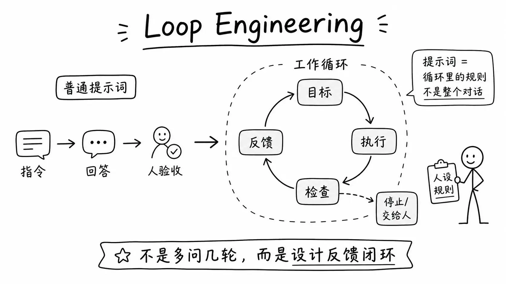
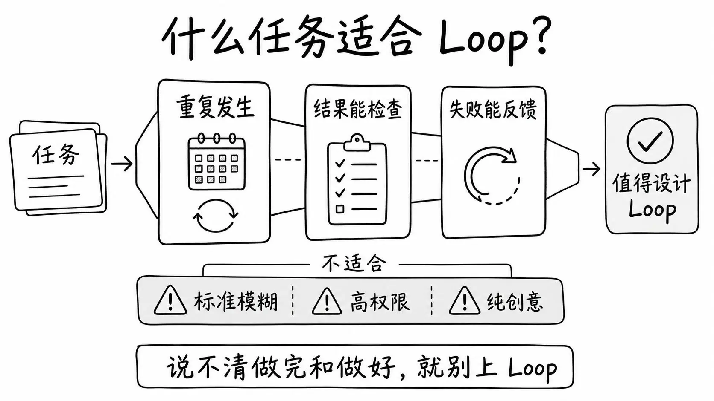
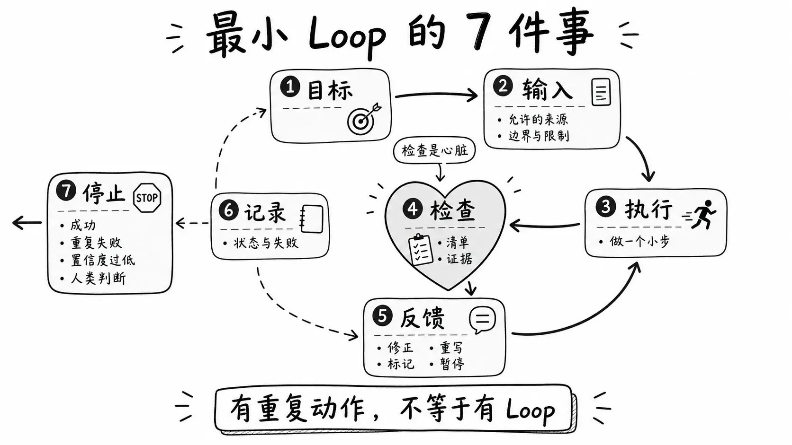
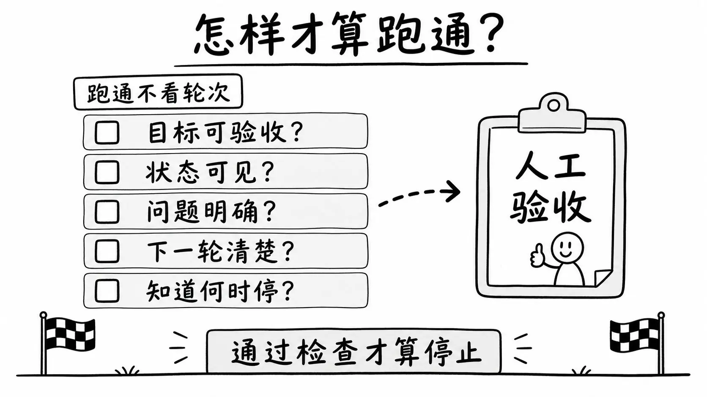

最近好多人开始讨论 Loop Engineering。

这到底是个啥？AI 圈又出了一个新概念吗？

说实话，AI 发展太快，这两年冒出来的新概念太多了。很多是包装出来的噱头，大部分没必要追。但我看完 Loop Engineering 之后，觉得这个东西不太一样。它不是什么突然降临的新技术，而是一套新的和 AI 共处的规范和框架。

它不是凭空冒出来的。它更像是把过去用 AI 时已经在做的动作，比如给目标、分步执行、检查结果、发现问题后返工、记录状态、设置停止条件、必要时交给人，重新整理成了一套更清楚的工作规则。

过去你用 AI，这些动作其实已经在做了。你让它生成，你看一遍，改一句再丢回去，不满意再让它重来。你就是那个循环发动机。只是这些动作一直靠你手动推进，没人给它取名字。

这套规则最有价值的地方，是它把一件事说清楚了。很多人以为自己在让 AI 干活，其实自己一直在旁边盯流程。

所以这篇文章，我就想讲清三件事。它到底是什么，和普通提示词有什么区别，小白怎么先跑一个小循环。

## 到底啥是 Loop Engineering？



先把它当成一个普通问题来看。它和我们平时写提示词，到底有什么不一样？

你平时用 AI 的典型场景，应该不陌生。打开对话框，写一段指令，AI 给你结果，你看一看，不满意就再补一句，满意就复制走。每一轮都是从你发起、到你验收结束。

Loop 的思路不一样。你提前设计一套工作规则，不用一轮一轮亲自下指令。这套规则告诉 AI 目标是什么、每一步做什么、做完怎么检查、不合格怎么处理、什么时候停、什么时候找你。

先澄清几个容易误解的说法。

普通提示词更像把一次任务说清楚：你告诉 AI 要做什么，它给你一个回答，这轮就结束了。Loop 是把目标、执行、检查、反馈和停止接成一套工作规则，AI 做完一步之后，按照这套规则自己推进下一步，不用等你给下一句指令。

提示词没有消失。它只是从「全部交互」变成了循环里的一个零件。以前你的提示词就是整个对话。现在你的提示词是给这个循环定的规矩，告诉 AI 什么算合格、什么算失败、失败了怎么办。

还有一个容易搞混的说法，就是 AI 自我察觉。更准确的说法是 AI 按你预设的规则做质量自检。你提前告诉它什么叫合格、什么叫失败、失败之后怎么重试、什么时候必须停下来找人。不是它突然有了意识。

我看完以后，反而觉得它没那么玄。Loop Engineering 更适合理解成 AI Agent 时代一种正在被重新命名、重新规范化的实践方法。不是什么突然冒出来的新技术，也不是成熟学科。

这个词最近被讨论起来，跟 Addy Osmani 今年 6 月写的一篇文章有很大关系。他在文章里把这件事讲得很清楚，你不是自己去一轮轮催 AI，你设计一个系统去替你催。底层技术上，Simon Willison 之前聊 agentic loop 时也讲过类似的意思。LLM 在目标驱动下调用工具、看结果、再行动。只不过 Simon 讲的是 agentic loop，不是直接给 Loop Engineering 命名。

如果非要用一句话说清楚，Loop Engineering 就是给 AI 设计一套能围绕目标反复执行、检查、修正和继续推进的工作循环，而不是让人每一步都亲自提示。

## 什么任务适合用？



不是所有任务都值得上 Loop。

适合 Loop 的任务，至少得满足三个条件：

第一，重复发生。你每周都要做，或者每次新项目都要做。一次性任务不值得设计一套循环。

第二，结果能检查。你能说清楚什么叫「合格」，并且这个标准可以写成清单或者验证步骤。

第三，失败能反馈。上一轮没做好，下一轮能根据失败原因调整。如果每次失败的原因都不一样、没法形成规律，Loop 也帮不上忙。

比较适合的场景，举几个例子。

个人知识库，把散落资料编译成可追溯、可链接、能继续提问的 wiki 页面。内容生产前期，选题判断、素材拆解、大纲生成、事实校验。代码测试修复，改代码、跑测试、报错再修。

项目状态检查，任务进度、风险项、下一步。学习复盘，把学过的东西结构化、发现盲区。

这些任务的共同点是有明确交付物、有检查标准、需要多轮迭代。

不太适合的，也举几个例子。

纯创意。让 AI 画一幅好画，你没法写清楚什么算「好」。重大价值判断也一样，该不该跳槽、该不该合伙，AI 不能替你拍板。

事实来源不足或者标准模糊的任务，跑 Loop 只会放大不确定。你都不知道对错，怎么让 AI 检查自己对不对？

高权限操作就更不用说了。涉及账号、支付、删除、发布，一旦自动跑了没法撤回。

特别补一句。在知识库整理这个场景里，有一个很容易踩的坑，就是找不到关联时不一定是 AI 做错了。也可能说明这是新概念、孤立节点，或者本来就是低价值噪音。硬连出来的东西，反而会污染你的知识库。Loop 的检查结果不只是「重做」，有时候应该是「标记、停止、交给人判断」。

判断标准不复杂，就是你能不能提前说清楚什么叫「做完了」和什么叫「做好了」。 说不清楚，就别上 Loop。

## 先搭一个最小 Loop

第一个小 Loop 不需要复杂的工具，也不需要一上来理解所有 Agent 架构。



先准备七件事：目标、输入、执行、检查、反馈、记录、停止。

**目标**。这轮到底要完成什么。不要写成许愿，要写成能验收的东西。「帮我整理知识库」是许愿。「把这三篇资料编译进一个最小知识库，生成来源摘要、概念页、index 和 log，并标出待核验项」是目标。目标和许愿的区别是做完之后你能不能说清楚自己拿到了什么。

**输入**。AI 可以看什么素材，不能看什么素材。这一步很多人会跳过，但它是整个 Loop 的边界。AI 不知道什么东西不该用，你得告诉它。比如只依据这三篇资料，不要上网搜，不确定的地方标记出来。

**执行**。让 AI 做一小步，不要一口吃成胖子。不是「帮我整理整个知识库」，而是「先处理三篇同主题资料，只生成来源摘要、一个概念页、index 和 log」。

**检查**。用清单、引用核查或人工验收判断合不合格。检查是 Loop 的心脏。没有检查，循环就只是反复跑。 检查项要具体：有没有证据来源？有没有编造？有没有漏掉关键信息？

**反馈**。不合格以后怎么办。不同的失败要对应不同的处理方式。缺来源就补来源，概念页太散就重写，事实不确定就标记，关键冲突就暂停交给人。

**记录**。做到哪了，哪里失败了，下一步是什么。不需要复杂的系统，一个简单的状态说明就够了，写清楚当前轮次、已完成项、待处理项、失败项及原因。

**停止**。成功停止、失败过多停止、低置信度停止、规则冲突停止、需要人判断时停止。Loop 的核心不是多跑几轮，而是知道什么时候该停。 没有停止条件的循环，最后会变成 AI 一直在跑但产出没人看的局面。

这里有一个很多人会搞混的地方：有重复动作，不等于有 Loop。 假设你让 AI 自动遍历 100 个文件每个生成摘要，这件事看起来也在「循环」，但它只是批处理。因为它不会根据上一轮的结果调整下一轮的动作。第一篇摘要写得好不好，不影响第二篇怎么做。真正的 Loop，上一轮的输出会决定下一轮做什么：重做、调整、跳过、还是停。

## 拿个人知识库跑一遍

接下来用一个具体的例子跑一遍，让你看到一个小白也能试的 Loop 长什么样。

例子选「构建自己的个人知识库」。更准确一点，是借 Karpathy 提过的 LLM Wiki 思路，先跑一个最小版本。

不选高权限工具自动化，就因为两点。第一，它够安全，不会删文件、不会花钱、不会对外发东西。第二，它的价值你马上能感觉到。资料不是被总结完就消失，而是进入一套以后还能继续提问、继续更新的知识库。

LLM Wiki 的核心很简单。原始资料放一层，AI 编译后的 wiki 放一层，再用一份规则文件告诉 AI 怎么维护它。你不需要一上来做完整系统，先把最小闭环跑起来就够了。

任务目标不是让 AI 帮你总结几篇文章。总结用完就扔了。真正的目标是让 AI 把资料编译进知识库：每篇资料有来源摘要，重要概念有独立页面，index 能告诉你库里有什么，log 能记录这次处理了什么，冲突和不确定项会被标出来。

最小流程长这样。

先建一个很小的目录。`raw/` 放原始资料，`wiki/sources/` 放来源摘要，`wiki/concepts/` 放概念页，再准备一个 `wiki/index.md` 和一个 `wiki/log.md`。如果你用 Codex，就放一份 `AGENTS.md`；如果你用 Claude Code，就放一份 `CLAUDE.md`。这份规则文件只做一件事：告诉 AI 原始资料不能改、每个判断尽量指向来源、更新完要写 index 和 log。

然后只放三到五篇同主题资料进去。不要一上来扔几百篇。先让 AI 读取这些资料，为每篇生成来源摘要，保留原始出处和关键信息。

接着让它提取概念。如果某个概念已经有页面，就更新旧页面；没有，就新建一个概念页。重点不是把原文变短，而是把资料里的信息挂到一个能持续生长的知识网络上。

然后更新 index.md 和 log.md。index.md 让你知道现在这个知识库里有哪些来源、概念和入口。log.md 记录这次新增了什么、改了什么、哪里还需要你判断。

接下来是检查环节，这是整个 Loop 最关键的几步。

让它自己检查一遍。有没有来源摘要缺出处。有没有概念页里的判断找不到来源。有没有把不确定的事实写成确定事实。有没有为了显得知识库很完整，强行把两个不相关的概念连在一起。

根据检查结果决定下一步。如果缺来源，就退回补来源。如果概念页太散，就重写概念页。如果出现冲突，就标记冲突，暂停交给人。如果找不到关联，就标记为孤立节点，不要硬连。如果连续失败或涉及关键判断，停下来交给人。

真正有价值的不是 AI 总结了几篇资料，而是这个知识库以后能不能被你继续使用。 下次你想写文章、做课程、研究一个问题，不是从聊天窗口重新问一遍，而是让 AI 先读 index.md，再从你已经编译好的 wiki 里找答案。

这一步不需要你会写代码。用 Codex、Claude Code 这类能读写本地文件的 AI Agent 就可以。如果只是普通聊天 AI，也可以先把资料和目录结构贴进去模拟一遍。关键是你要当那个验收的人。 AI 输出了一堆字不算过。每一条判断都有来源、没有乱编、没有强行关联，才算过。

### 给你一段模板

下面是一段可以直接复制的最小 Loop 模板，适用于「个人 LLM Wiki 知识库」。

```markdown
任务目标：用 LLM Wiki 的思路，把我给你的资料编译进一个最小个人知识库。不是写摘要，而是让资料变成可追溯、可链接、以后还能继续提问的 wiki 页面。

输入范围：只能依据我给你的资料或 raw/ 里的资料。不确定的地方标记出来，不要编。原始资料只读，不要删除、覆盖或改写。

执行步骤：
1. 先读取现有的 index.md 和 log.md，了解知识库已有内容。
2. 为每份资料生成来源摘要页，保留标题、来源、核心主题和关键判断。
3. 提取重要概念，更新已有概念页；没有对应页面时，新建概念页。
4. 在概念页里标清楚哪些判断来自资料，哪些是你的概括。
5. 更新 index.md，让我知道现在库里有哪些来源、概念和入口。
6. 更新 log.md，记录这次处理了哪些资料、改了哪些页面、留下了哪些问题。
7. 列出事实风险、概念冲突、孤立节点和待人工判断项。

检查清单：
- 每个重要判断有没有来源？
- 来源摘要页有没有保留原始出处？
- index.md 和 log.md 有没有同步更新？
- 有没有乱编或过度推断？
- 有没有强行关联？
- 有没有把不确定事实写成确定事实？

反馈规则：
- 缺来源 -> 退回补来源。
- 概念页太散 -> 重写概念页。
- 事实不确定 -> 标记为「待核实」，不硬写。
- 找不到关联 -> 标记为「孤立节点」，不要硬连。
- 出现概念冲突或规则冲突 -> 暂停，交给人判断。

停止条件：
- 通过检查清单 → 停止。
- 连续两轮不合格 → 停止。
- 出现关键事实不确定 → 停止。
- 需要价值判断 → 停止，交给人。
```

第一次练习，不要给它账号、付款、删除、发布的权限。先从一个低风险的小任务开始，跑通了再往上加。

## 怎样才算跑通？

Loop 跑通，不看 AI 回答了几轮，也不看输出了多少内容。



跑通不看轮次，看你能不能回答这几个问题。

目标是不是具体到能验收？「把这三篇资料编译进最小知识库，生成来源摘要、更新概念页、同步 index 和 log，并标出待核实项」是目标。而「帮我整理知识库」是许愿。

你知道 AI 现在在干什么吗？是在生成来源摘要、更新概念页、同步 index，还是在自检。丢进去一片黑，第二轮出来一堆东西你也不知道它是重做了还是继续跑了，那就不算跑通。

你知道哪里不合格吗？得真的知道，比如这条判断缺了来源，这个概念跟已有页面冲突，index 没更新，或者这段强行把两个不相关的东西连在一起了。

下一轮怎么改，你能说出来吗？缺来源就补来源，概念页结构差就重写概念页，index 或 log 漏更新就补更新，出现冲突就暂停让人判断。不是笼统的「再试一次」。

什么情况该停，提前说好了吗？成功通过检查能停、连续失败太多能停、置信度太低能停、规则互相冲突能停、需要你来做价值判断时能停。每种情况都有对应的停止动作，AI 不会自己决定「再跑一轮看看」。

最后，你看过了吗？你确认了，才算完。

特别强调，完成一次编译不等于停止。AI 跑完一轮输出了一堆页面，不等于这些页面能通过你的检查。通过质量检查后的知识库更新，才算停止。

没有人工验收的 Loop，很容易变成 AI 自己给自己发奖状。 它跑了很多轮，输出了一大堆，你一看发现方向早就偏了。

跑通的标准很简单，结果能通过你定的检查。

## 新手最容易跑偏

最后集中讲几个新手最容易踩的坑。

把长提示词当 Loop。写一大段提示词，里面塞了各种规则，然后每次丢一个任务进去。这看起来很复杂，但本质还是 Prompt Engineering，你给了一个复杂的指令，AI 执行了一次。除非它会自己检查结果、决定重做、遇到不确定性暂停，否则它只是一个复杂提示词，不是 Loop。长提示词不是 Loop，反馈闭环才是 Loop。

目标太大。一上来就想全自动整理整个知识库、全自动写文章、全自动做项目。结果就是一跑就偏，偏了也不知道从哪改。先让 AI 编译三到五篇同主题资料，把来源摘要、概念页、index 和 log 跑通再说。

标准太虚。比如「写得更好一点」「分析得更深一点」。这种标准 AI 没法判断，你自己也没法验收。标准必须能检查，比如有没有证据、有没有漏掉关键信息、有没有编造、来源能不能对上。

没人检查，就没人喊停。让 AI 自己做、自己验、自己宣布完成，这是最容易翻车的地方。执行和检查必须拆开，做的人不能自己给自己批改。最简单的做法就是让 AI 先做一遍，再让它按检查清单自己审一遍。同样，没有停止条件的话它就会一直跑，消耗 token 和时间，最后产出一堆没人看的东西。第一个 Loop 最好先写死上限：最多跑几轮、同一类错误重复出现就停，不要让它无限续杯。

找不到关联还硬连。有些知识点本来就是孤立的，或者本来就是新东西。硬把它们跟已有内容连起来，最后污染整个知识库。Loop 做知识库整理时，标记「未关联」也是有效产出。

权限给太大。把低风险练习变成了高风险事故。第一次跑 Loop，不要给它删除文件、发消息、提交表单、操作账户的权限。

还有一件事。Loop 不是免费的。 它把你在对话框前盯着的时间，换成了 token 消耗和检查成本。低价值任务不值得设计闭环，做之前先算一下账。

没有检查标准的自动化，只是在自动制造垃圾。 能跑起来不难，难的是跑偏时知道停。

## 写在最后

Loop Engineering 把目标、执行、检查、反馈和停止这些动作规范化了。

对小白来说，先别急着搭复杂系统，也别急着追所有工具名。先选一个低风险、可检查的小任务，试着让 AI 按一个小循环跑起来。

说到底，目标能验收、检查可执行、停的时候有人喊。

人不是从流程里消失了。 人只是从每轮亲自提示的人，变成了设计目标、规则、闸门和最终验收的人。

Build the loop, Stay the engineer.
